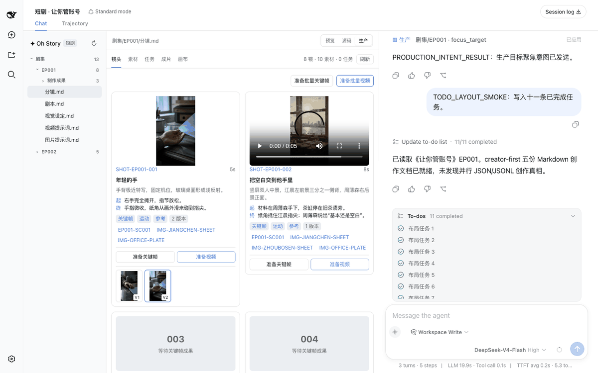
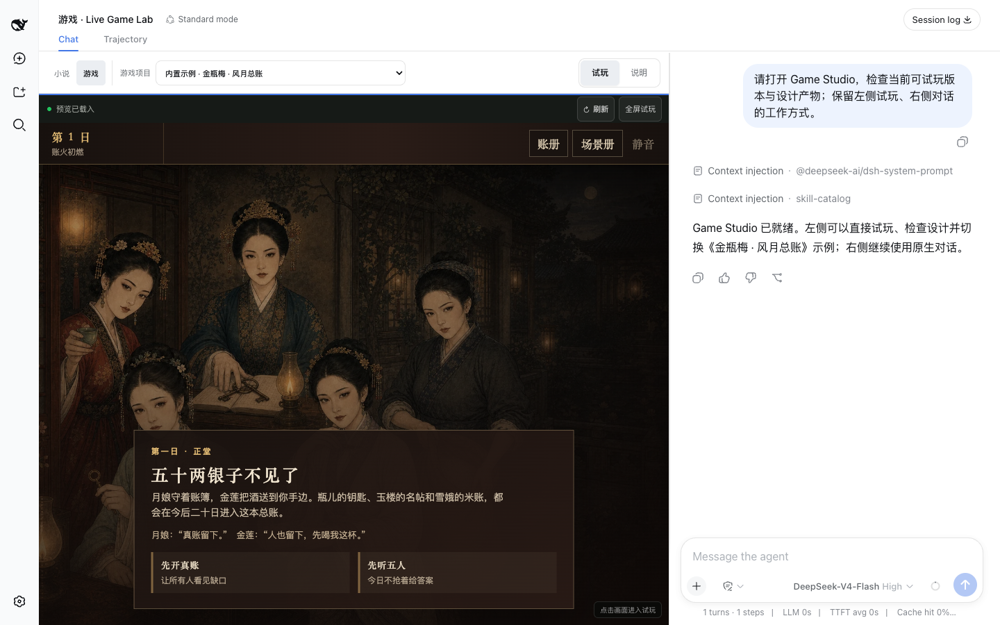

<div align="center">

# oh-story-dsh

**小说、短剧、互动游戏与视频解说创作工作台**

[DeepSeek Harness](https://github.com/deepseek-ai/deepseek-harness) · [Oh Story](https://github.com/zenstory-ai/oh-story-claudecode) · [Drama Skills](https://github.com/zenstory-ai/drama-skills) · [NovelToGame](https://github.com/zenstory-ai/novel-to-game) · [video-recap-skills](https://github.com/zenstory-ai/video-recap-skills) · [MIT](LICENSE)

</div>

`oh-story-dsh` 是基于 DeepSeek Harness（DSH）构建的社区插件，将小说、短剧、互动游戏与 video-recap 视频解说流水线带入 DSH。DSH 管理 Agent、会话、模型、权限和 Chat；插件提供创作 Skills、专业 Roles、项目协议与对应工作台。

> 本项目与 DeepSeek 官方无隶属、合作或背书关系；DeepSeek Harness 名称与品牌素材归其权利人所有。

## 小说工作台


覆盖长篇、短篇、选题、扫榜、拆文、导入、审稿、去 AI 味与封面流程。13 个 Oh Story Skills 与 7 个专业 Roles 按固定上游版本随插件交付。

## 短剧工作台



内置 Drama Skills 0.6.1 的 creator-first 工作流。每集按请求维护最多五份可读 Markdown：`剧本.md`、`视觉设定.md`、`分镜.md`、`图片提示词.md`、`视频提示词.md`；不预建空文档，也不倒补用户未点名的阶段。「生产」视图按轻量 `short-drama/v1` 协议把这些文档投影为镜头板、素材板、任务/版本、成片顺序和关系画布，并就地提示重复 ID、悬空引用和格式错误，不建立第二份创作真相。审查与生产交付继续使用 DSH 原生会话、当前 Preset 工具、权限和确认界面。

## 游戏制作面板



游戏模式采用聚焦的两列布局：左侧是隔离运行、可直接操作的实时游戏预览，右侧保留完整 DSH Chat。使用 `/novel-to-game quick` 后，生成物写入 `game-adaptations/<project>/`；当 `build/app/index.html` 就绪时会自动进入项目列表，可在不离开对话的情况下刷新、全屏和试玩。

内置《金瓶梅 · 风月总账》的完整可玩构建，方便开箱验证输入、核心循环、结局与重开流程；上游的产品简报、分析、设计与源小说不随包分发。试玩 iframe 在切换项目文件或窄屏对话时保持挂载，不会丢失当前进度；新构建就绪后由创作者主动载入，不会因为转去 Chat 而静默覆盖正在玩的版本。正式 QA 继续由 `/game-qa`、原生 Agent 工具结果与 `qa/verification.json` 承担，不在制作面板增加独立 QA 页。

## 视频预览工作台

视频模式采用“左侧预览 + 右侧 DSH Chat”的轻量两列布局。完整打包 [video-recap-skills 0.4.0](https://github.com/zenstory-ai/video-recap-skills) 的 6 个 Skills，项目放在 `video-recaps/<project>/`：原片位于 `sources/`，上游权威工作产物位于 `work/`，可选交付位于 `outputs/`。工作台只提供原片、剪后片和最终成片切换、阶段提示、全屏、刷新以及关键计划/字幕/质检产物查看，不内置多轨时间线或重型编辑器。

视频文件通过 HTTP Range 流式预览；新成片出现时保留当前播放，由创作者主动载入新版。运行环境检查只显示 Python 3.10+、ffmpeg/libass、ffprobe 与 Key 是否就绪，不把 `MIMO_API_KEY`、`FISH_API_KEY` 或音色凭据发送给浏览器。视频流水线还需要宿主机安装 Python 3.10+ 和带 `subtitles` 滤镜的 ffmpeg。当前 macOS Homebrew 的普通 `ffmpeg` formula 不包含 libass，可安装 `python@3.12` 与 `ffmpeg-full`，并在启动 DSH 前把 `$(brew --prefix ffmpeg-full)/bin` 放到 `PATH` 前面；以工作台运行环境检查或 `video-recap --doctor` 的实际结果为准。

在 Chat 中直接描述输入和目标即可，例如：

```text
给 /path/to/video.mp4 做一个 3 分钟中文解说成片，保留关键原声，字幕烧进画面。
把 /path/to/ep1.mp4 和 /path/to/ep2.mp4 围绕同一主线剪成 10 分钟解说。
把 /path/to/english.mp4 翻译成中文配音，保留原说话人的声音。
```

## 核心体验

- **按任务优化的布局**：小说/短剧保留文件树、编辑器、Chat 三栏；游戏与视频使用“左侧工作台 + 右侧 Chat”两列。
- **实时游戏预览**：Agent 生成 `build/app/` 后自动发现可试玩版本；预览隔离运行，支持刷新、全屏、项目切换与构建期间保留上一版。
- **实时文件跟随**：Agent 调用官方文件工具时，目标文件自动定位，编辑器同步呈现生成中的内容。
- **Chat 文件导航**：点击官方 Chat 中的作品文件名，文件树会定位并在编辑器打开对应文件。
- **创作文档预览**：Markdown 支持标题、表格、任务列表、引用和代码块；JSONL 以带行号、类型和状态的结构化记录呈现。
- **短剧生产工作台**：从五份 creator-first Markdown 联动镜头、角色/场景/道具与提示词，支持单项/批量预检、明确确认后投产、Queue 移除、当前 Turn 停止、成果回填、版本选择、缺镜检查和成片顺序；提示词仍在权威 Markdown 或普通 DSH Chat 中编辑。
- **项目媒体库**：自动汇总当前 DSH workspace 中各集和交付目录的真实图片/视频成果，支持搜索、类型筛选、打开原文件，以及把跨集图片显式挂为某个镜头的额外参考。
- **关系画布与 Agent 操作**：把视觉设定与镜头关系投影为可拖拽、键盘移动和缩放的画布；画布坐标由创作者控制，Agent 只通过显式 `oh_story_production` 工具打开/聚焦语义目标、设置顺序和登记实际任务。工具不改创作文档、不生成媒体，也不替代生产确认。
- **真实生成契约**：可选内置 GPT Image 2、Seedance 与 MiniMax Music adapter；账号、模型、凭据和可用性仍由 DSH 运行环境与项目外配置决定。仓库媒体仅用于离线交互回归，不伪装成供应商成功。
- **安全编辑**：支持源码编辑与快捷保存；人工未保存内容不会被并发 Agent 修改覆盖。
- **稳定长对话**：消息区独立滚动，官方 Composer 固定在 Chat 栏底部。

## 能力目录

| 工作台 | 上游能力 | 主要入口 |
| --- | --- | --- |
| 小说 | [Oh Story 0.7.8](https://github.com/zenstory-ai/oh-story-claudecode/releases/tag/v0.7.8) · 13 Skills · 7 Roles | `/story`、`/story-long-write`、`/story-review` |
| 短剧 | [Drama Skills 0.6.1](https://github.com/zenstory-ai/drama-skills/releases/tag/v0.6.1) · 10 Skills | `/short-drama`、`/short-drama-write`、`/short-drama-storyboard` |
| 游戏 | [NovelToGame 0.3.0](https://github.com/zenstory-ai/novel-to-game) · 7 Skills · 《金瓶梅》可玩示例 | `/novel-to-game quick`、`/game-build`、`/game-qa` |
| 视频 | [video-recap-skills 0.4.0](https://github.com/zenstory-ai/video-recap-skills) · 6 Skills | `/video-recap`、`/video-script` |

## 安装

需要 Node.js 24+。

**1. 安装插件并启动 DSH Web**

```bash
npx -y @deepseek-ai/dsh@0.1.1-rc.1 plugin --profile web add @oh-story/dsh@0.1.4
npx -y @deepseek-ai/dsh@0.1.1-rc.1 web
```

也可以直接安装 GitHub Release 中经过同一套测试的预构建包：

```bash
npx -y @deepseek-ai/dsh@0.1.1-rc.1 plugin --profile web add https://github.com/zenstory-ai/oh-story-dsh/releases/download/v0.1.4/oh-story-dsh-0.1.4.tgz
npx -y @deepseek-ai/dsh@0.1.1-rc.1 web
```

默认在 `http://127.0.0.1:3080` 打开。

**2. 配置模型**

首次使用需要在 DSH 的「设置 → 模型」中添加 Provider 并填入 API Key；也可以在启动前设置环境变量 `DEEPSEEK_API_KEY`。模型、凭据与权限均由 DSH 管理，本插件不接触。

**3. 开始创作**

添加作品目录为 workspace，新建或打开 Session 后使用 `/story`、`/short-drama`、`/novel-to-game quick` 或 `/video-recap`。四个工作台可随时通过顶部 Tab 切换。

## 按需加载

插件装进哪个 profile，那个 profile 的每个 Session 就都会加载创作 Skills 与三栏工作台。想让原版 `web` 保持干净、只在创作时打开工作台，就把插件装进独立 profile。

**1. 装进独立 profile**

```bash
npx -y @deepseek-ai/dsh@0.1.1-rc.1 plugin --profile story add @oh-story/dsh@0.1.4
```

**2. 补上界面**

新 profile 默认没有界面。编辑 `~/.dsh/profiles/story/package.json`，把 `dsh.profile.bundles` 改成：

```jsonc
"bundles": [
  "@deepseek-ai/dsh-base",
  "@deepseek-ai/dsh-web-app",
  "@oh-story/dsh"
]
```

顺序照抄，这个包不用另外安装。

**3. 按需启动**

```bash
npx -y @deepseek-ai/dsh@0.1.1-rc.1 web                          # 原版 DSH
npx -y @deepseek-ai/dsh@0.1.1-rc.1 --profile story --port 3081  # 创作工作台
```

两个 profile 用不同端口可以同时运行。模型、凭据、workspace 与历史会话由 DSH 统一保存，切换 profile 不会丢。

安装与启动请使用同一个 dsh 版本；混用会报 `unknown option '--no-open'` 一类的错。

## 致谢

- [DeepSeek Harness](https://github.com/deepseek-ai/deepseek-harness)：提供原生插件运行时、Agent、会话、权限审批与 Web 工作台基础。
- [LINUX DO](https://linux.do/)：感谢社区的交流、反馈与开源支持。

[更新日志](CHANGELOG.md) · [贡献指南](CONTRIBUTING.md) · [架构说明](docs/ARCHITECTURE.md) · [安全策略](SECURITY.md)
