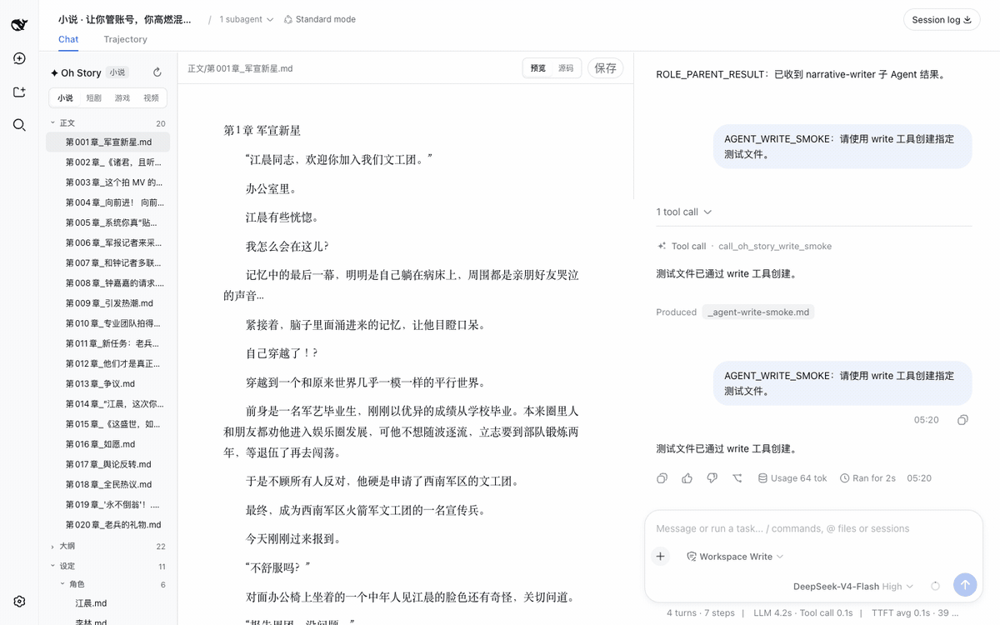
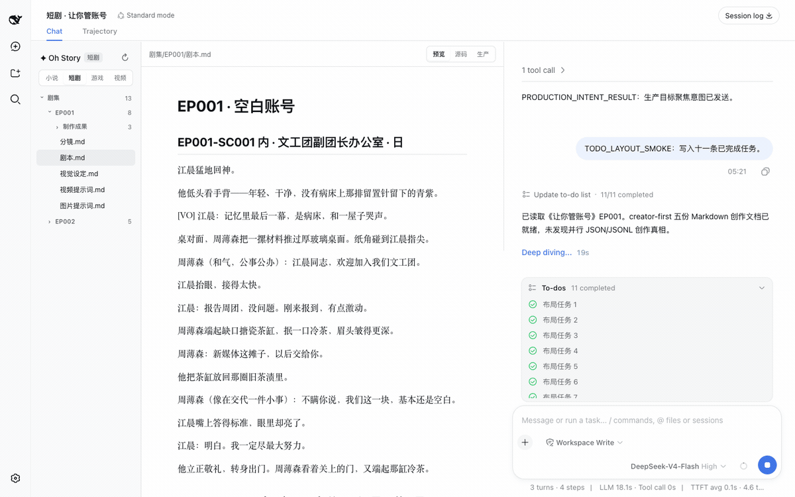
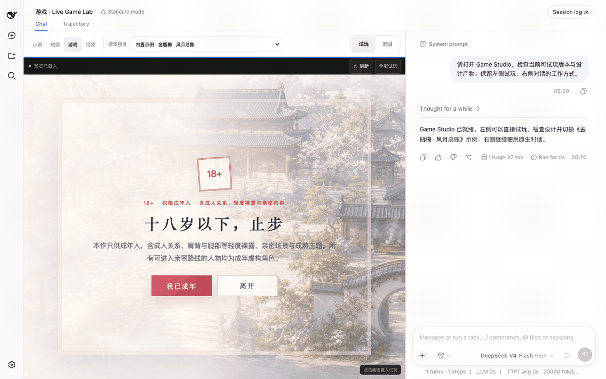
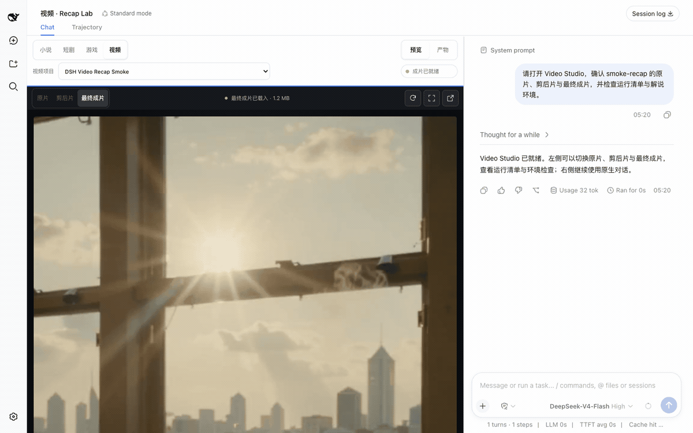

**English** | [中文](README.md)

<div align="center">

# oh-story-dsh

**A novel, short-drama, interactive-game and video-recap creation workbench for DeepSeek Harness**

[DeepSeek Harness](https://github.com/deepseek-ai/deepseek-harness) · [Oh Story](https://github.com/zenstory-ai/oh-story-claudecode) · [Drama Skills](https://github.com/zenstory-ai/drama-skills) · [NovelToGame](https://github.com/zenstory-ai/novel-to-game) · [video-recap-skills](https://github.com/zenstory-ai/video-recap-skills) · [MIT](LICENSE)

</div>

`oh-story-dsh` is a community plugin built on DeepSeek Harness (DSH) that brings four creation pipelines — novels, short drama, interactive games and video recaps — into DSH. DSH manages agents, sessions, models, permissions and Chat; the plugin provides the creation Skills, professional Roles, project contracts and a workbench for each pipeline.

> This project is not affiliated with, partnered with, or endorsed by DeepSeek. The DeepSeek Harness name and brand assets belong to their rights holders.

## Novel workbench



Three panes: file tree, editor, Chat. Covers long-form and short-form writing, topic selection, chart scanning (扫榜), deconstruction (拆文), import, review, de-AI editing (去AI味) and covers. The 13 Oh Story Skills and 7 professional Roles ship with the plugin at a pinned upstream version.

## Short-drama workbench



Each episode keeps up to five readable Markdown files on request: `剧本.md` (screenplay), `视觉设定.md` (visual bible), `分镜.md` (storyboard), `图片提示词.md` (image prompts) and `视频提示词.md` (video prompts). The Production view projects those documents into a shot board, an asset board, tasks/versions, final-cut order and a relationship canvas, and flags duplicate IDs, dangling references and format errors in place. Final assembly is handed to `/short-drama-edit`, which writes the scheduled shot order into `剪辑单.md` (the edit decision list) and renders it into `剧集/<EP>/制作成果/成片/`. Production deliveries go through DSH's native session, the current Preset's tools and permission confirmations.

## Game workbench



Two columns: live playtest on the left, DSH Chat on the right. Output from `/novel-to-game quick` is written to `game-adaptations/<project>/`; once `build/app/index.html` is ready the project appears in the list automatically and can be refreshed, made full-screen or switched. A complete playable build of 《金瓶梅 · 风月总账》 is bundled so you can verify input, the core loop, endings and restart out of the box.

## Video workbench



Preview on the left, Chat on the right. Projects live in `video-recaps/<project>/`: source footage in `sources/`, upstream working files in `work/`, deliverables in `outputs/`. The workbench switches between source / rough cut / final, shows stage hints, a run checklist and QC artifacts, and streams video over HTTP Range. Describe the goal directly in Chat:

```text
给 /path/to/video.mp4 做一个 3 分钟中文解说成片，保留关键原声，字幕烧进画面。
把 /path/to/english.mp4 翻译成中文配音，保留原说话人的声音。
```

(“Make a 3-minute Chinese narrated recap of /path/to/video.mp4, keep key original audio, burn subtitles into the picture.” / “Dub /path/to/english.mp4 into Chinese and keep the original speaker's voice.”)

## Core experience

- **Live file follow**: when the agent calls the official file tools, the target file is located automatically and the editor shows the content as it is generated.
- **Chat file navigation**: click a work file name in the official Chat and the file tree locates it and opens it in the editor.
- **Creation document preview**: Markdown renders headings, tables, task lists, quotes and code blocks; JSONL is shown as structured records with line numbers, type and status.
- **Project media library**: automatically gathers the real image/video outputs from every episode and delivery directory in the current workspace, with search, type filters and cross-episode references.
- **Real generation contracts**: optional built-in GPT Image 2, Seedance and MiniMax Music adapters; accounts, models, credentials and availability are decided by the DSH runtime and configuration outside the project.
- **Safe editing**: source editing with quick save; unsaved manual edits are never overwritten by a concurrent agent.
- **Stable long conversations**: the message area scrolls independently and the official Composer stays pinned to the bottom of the Chat pane.
- **Stays out of other scenarios**: the workbench only takes over the session layout when the current workspace contains a novel, short-drama, game or video project. It can be collapsed at any time, returning the session to native DSH; the choice is remembered per workspace.

The capability boundaries and protocol constraints of each workbench are described in the [architecture notes](docs/ARCHITECTURE.md).

## Capability catalogue

| Workbench | Upstream capability | Main entry points |
| --- | --- | --- |
| Novel | [Oh Story 0.7.10](https://github.com/zenstory-ai/oh-story-claudecode/releases/tag/v0.7.10) · 13 Skills · 7 Roles | `/story`, `/story-long-write`, `/story-review` |
| Short drama | [Drama Skills 0.7.0](https://github.com/zenstory-ai/drama-skills/releases/tag/v0.7.0) · 11 Skills | `/short-drama`, `/short-drama-write`, `/short-drama-storyboard`, `/short-drama-edit` |
| Game | [NovelToGame 0.3.1](https://github.com/zenstory-ai/novel-to-game) · 7 Skills · playable 《金瓶梅》 sample | `/novel-to-game quick`, `/game-build`, `/game-qa` |
| Video | [video-recap-skills 0.5.0](https://github.com/zenstory-ai/video-recap-skills) · 6 Skills | `/video-recap`, `/video-script` |

## Installation

The install command provides pnpm temporarily, so a machine with only Node.js can run it. DSH's `plugin add` needs pnpm internally, and running `npx @deepseek-ai/dsh ... plugin add` on its own will not supply it.

Requires Node.js 24+. The video workbench pipeline additionally needs Python 3.10+ and ffmpeg/ffprobe built with the libass `subtitles` filter on the host (macOS `brew install ffmpeg`, Debian/Ubuntu `sudo apt install ffmpeg`).

**1. Install the plugin and start DSH Web**

```bash
npx -y --package pnpm@11.7.0 --package @deepseek-ai/dsh@0.1.5-rc.1 dsh plugin --profile web add @oh-story/dsh@0.1.9 &&
npx -y @deepseek-ai/dsh@0.1.5-rc.1 web
```

You can also install the prebuilt package from the GitHub Release, which passes the same test suite:

```bash
npx -y --package pnpm@11.7.0 --package @deepseek-ai/dsh@0.1.5-rc.1 dsh plugin --profile web add https://github.com/zenstory-ai/oh-story-dsh/releases/download/v0.1.9/oh-story-dsh-0.1.9.tgz &&
npx -y @deepseek-ai/dsh@0.1.5-rc.1 web
```

Keep the terminal running; the browser opens automatically by default. If it does not, copy the full `http://127.0.0.1:3080/?token=...` link printed in the terminal — first-time authentication needs the token in the link. Closing the terminal stops the service.

**2. Configure a model**

Before creating with AI, add a Provider and API key under DSH's Settings → Models, or set the `DEEPSEEK_API_KEY` environment variable before starting. If you only want to browse existing work, choose "Configure later" in the first-run guide. Models, credentials and permissions are all managed by DSH; this plugin never touches them.

**3. Configure media-generation APIs (needed for short-drama production)**

DeepSeek only writes the screenplay, storyboard and prompts; it does not generate images, video or music itself. Short-drama Production hands those prompts to the `short-drama-produce` Skill, which calls the vendor APIs below. Keys are not entered in the UI — set them as host environment variables before starting DSH:

| Capability | Vendor | Required variables | Optional |
| --- | --- | --- | --- |
| Images | GPT Image 2 | `OPENAI_API_KEY` | `OPENAI_BASE_URL` |
| Video | Seedance (Volcengine Ark) | `ARK_API_KEY`, `SEEDANCE_MODEL` | `SEEDANCE_BASE_URL`, `SEEDANCE_ALLOWED_RATIOS`, `SEEDANCE_MIN_DURATION`/`SEEDANCE_MAX_DURATION` |
| Video | MiniMax H3 | `MINIMAX_API_KEY`, `MINIMAX_VIDEO_MODEL`, `MINIMAX_VIDEO_RESOLUTIONS` | `MINIMAX_VIDEO_BASE_URL`, `MINIMAX_VIDEO_RATIOS`, `MINIMAX_VIDEO_MIN_DURATION`/`MINIMAX_VIDEO_MAX_DURATION` |
| Music | MiniMax Music | `MINIMAX_API_KEY` | `MINIMAX_BASE_URL` |

```bash
export OPENAI_API_KEY=...            # images
export ARK_API_KEY=... SEEDANCE_MODEL=...   # video; use the model / Endpoint ID enabled on your account
npx -y @deepseek-ai/dsh@0.1.5-rc.1 web
```

Configure only what you use: without a video key you can still write storyboards and generate keyframe images. The top of the short-drama Production view shows whether each vendor is configured and which variable is missing; the plugin only reports whether a variable exists and never reads or displays its value. On startup the plugin registers the four built-in adapters in a credential-free config file (by default under a user-only `oh-story-dsh-<uid>/` directory in the system temp folder; the "generation environment" bar shows the full path), which the agent references directly when it runs `production_tool.py run`. To use your own adapter or change timeouts, point `OH_STORY_DRAMA_ADAPTER_CONFIG` at your file. Per-vendor parameters, resolution and duration constraints are documented in the bundled `short-drama-produce/references/providers/`.

The video-recap workbench uses `MIMO_API_KEY` (and `FISH_API_KEY` for Fish Audio TTS); novel covers use whichever image-generation tool is visible in the current Preset.

**4. Start creating**

On first entry you will see the DSH home page. Click **＋ (Add workspace)** next to Workspaces on the left, choose the folder that holds your work, then select that directory under **Choose workspace** below; DSH opens an empty session. You can also open an existing session from the left. When the directory already contains creation projects, four workbench tabs appear: Novel / Short drama / Game / Video.

An empty directory keeps the native DSH Chat. Once a model is configured, type `/story`, `/short-drama`, `/novel-to-game quick` or `/video-recap` to start; the workbench appears automatically after the agent writes its first creation file. Browsing existing work does not require an API key. A collapsed workbench can be reopened with the "creation workbench" button in the session area.

## If you do not see the interface

- **Install reports `pnpm not found on PATH`**: rerun the full install command above that includes `--package pnpm@11.7.0`, confirm it succeeds, then start.
- **Browser did not open or asks for authentication**: open the full link with `?token=...` printed in the terminal; if the port is taken, use `web --port 3081` and open the newly printed link.
- **No four creation tabs**: add a work directory and open a session first. In an empty directory, run a creation command in Chat; the workbench appears once creation files exist. A collapsed workbench can be restored with the "creation workbench" button in the session area. If existing work still does not show, check that install and start used the same profile, restart DSH and refresh the page.
- **A standalone `story` profile has no web service**: add `@deepseek-ai/dsh-web-app` as described in the next section; installing only the creation plugin does not give a new profile a Web UI.

## Load on demand

Whichever profile the plugin is installed into, every Session of that profile loads the creation Skills; the workbench itself only shows when a creation project exists. To keep the stock `web` profile clean and open the workbench only when creating, install the plugin into a separate profile.

**1. Install into a separate profile**

```bash
npx -y --package pnpm@11.7.0 --package @deepseek-ai/dsh@0.1.5-rc.1 dsh plugin --profile story add @oh-story/dsh@0.1.9
```

**2. Add the interface**

A new profile has no UI by default. Edit `~/.dsh/profiles/story/package.json` and set `dsh.profile.bundles` to:

```jsonc
"bundles": [
  "@deepseek-ai/dsh-base",
  "@deepseek-ai/dsh-web-app",
  "@oh-story/dsh"
]
```

`@deepseek-ai/dsh-web-app` is DSH's own Web UI package and must load before the creation plugin.

**3. Start on demand**

```bash
npx -y @deepseek-ai/dsh@0.1.5-rc.1 web                          # stock DSH
npx -y @deepseek-ai/dsh@0.1.5-rc.1 --profile story --port 3081  # creation workbench
```

The two profiles can run at the same time on different ports. Models, credentials, workspaces and session history are stored centrally by DSH and survive profile switches. Use the same dsh version for install and start; mixing versions produces errors such as `unknown option '--no-open'`.

## Acknowledgements

- [DeepSeek Harness](https://github.com/deepseek-ai/deepseek-harness): the native plugin runtime, agents, sessions, permission approvals and Web workbench foundation.
- [LINUX DO](https://linux.do/): thanks to the community for discussion, feedback and open-source support.

[Changelog](CHANGELOG.md) · [Contributing](CONTRIBUTING.md) · [Architecture](docs/ARCHITECTURE.md) · [Security policy](SECURITY.md)

## Part of ZenStory AI

oh-story-dsh is maintained by [ZenStory AI](https://zenstory.ai) — open-source, agent-native tools for creating, adapting and producing stories (GitHub org: [zenstory-ai](https://github.com/zenstory-ai)). Sibling projects:

| Project | What it does |
| --- | --- |
| [oh-story-claudecode](https://github.com/zenstory-ai/oh-story-claudecode) | Web-fiction writing skill pack: chart scanning, deconstruction, drafting, de-AI-flavor, covers |
| [drama-skills](https://github.com/zenstory-ai/drama-skills) | AI short-drama / motion-comic suite: scripts, assets, storyboards, image & video prompts, review |
| [novel-to-game](https://github.com/zenstory-ai/novel-to-game) | Agent skills that turn novels into playable games |
| [video-recap-skills](https://github.com/zenstory-ai/video-recap-skills) | Clip any video into a narrated Chinese recap, with CapCut draft export |
| [oh-story-dsh](https://github.com/zenstory-ai/oh-story-dsh) | DeepSeek Harness plugin wrapping the Oh Story and Drama Skills workflows (this repo) |
| [zenstory](https://github.com/zenstory-ai/zenstory) | Chat-to-create AI novel-writing workbench (zenstory.ai) |
