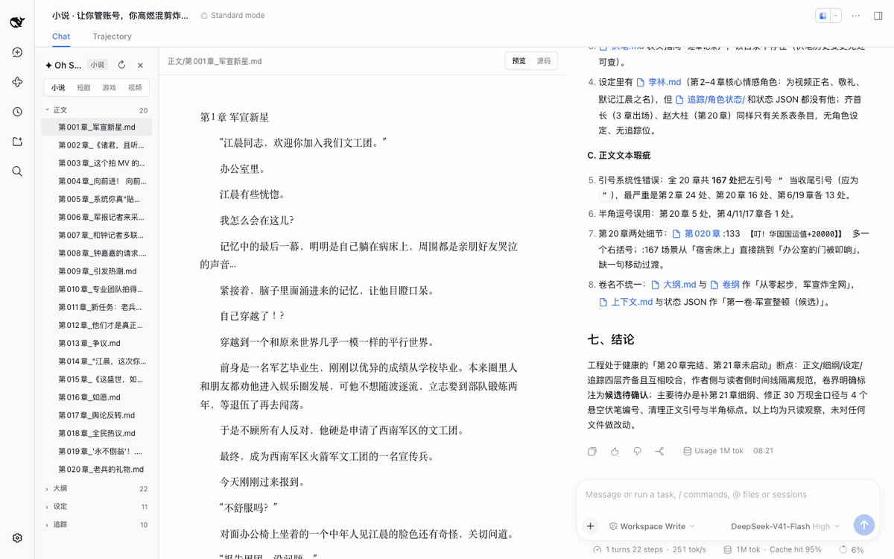
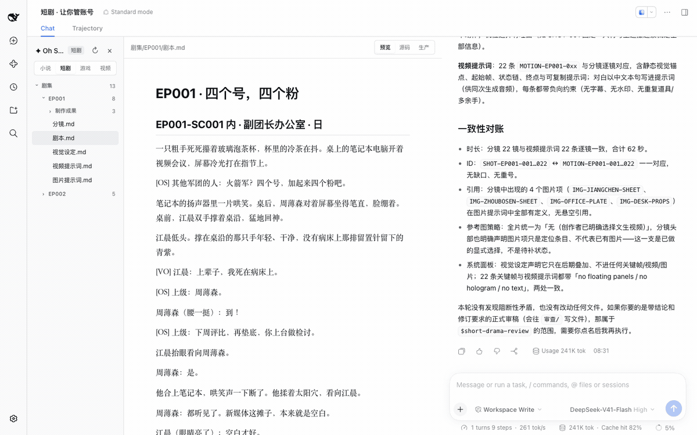
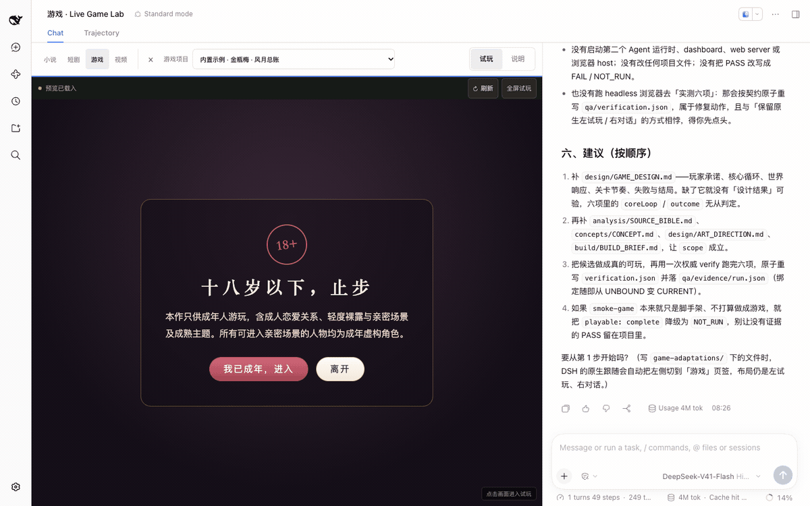
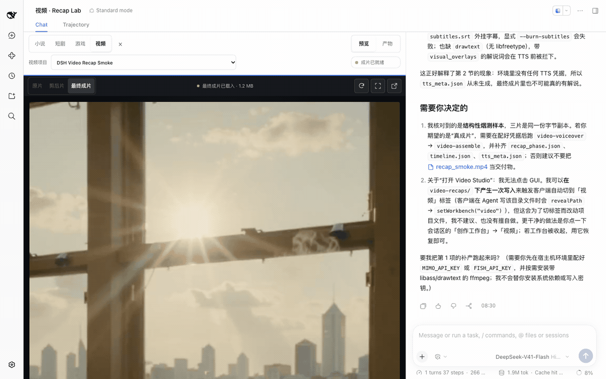

<!-- Last synced with README.md: 2026-10-03 -->

<p align="center">
  
</p>

<h1 align="center">Oh Story DSH</h1>

<p align="center">
  <b>A novel, short-drama, interactive-game and video-recap creation workbench for DeepSeek Harness.</b>
</p>

<p align="center">
  <a href="https://zenstory.ai/dsh"><b>Project page</b></a>
  &nbsp;·&nbsp;
  <a href="#installation"><b>Install</b></a>
  &nbsp;·&nbsp;
  <a href="#see-what-it-produces"><b>See what it produces</b></a>
  &nbsp;·&nbsp;
  <a href="README.md"><b>中文</b></a>
</p>

<p align="center">
  <a href="https://github.com/zenstory-ai/oh-story-dsh/stargazers"></a>
  <a href="https://github.com/zenstory-ai/oh-story-dsh/releases/latest"></a>
  
  <a href="./LICENSE"></a>
</p>

<p align="center">
  <a href="https://github.com/zenstory-ai/oh-story-dsh/issues"></a>
</p>

## What it is

`oh-story-dsh` is a community plugin for [DeepSeek Harness](https://github.com/deepseek-ai/deepseek-harness) (DSH), independent of DeepSeek. Install it and DSH Web gains four creation workbenches: novel, short drama, game and video recap. Agents, sessions, models, permission approvals and Chat stay entirely native DSH; the plugin adds only creation Skills, professional Roles, project file contracts and the workbench UI, with no second agent runtime or project database.

| Workbench | Upstream capability (pinned, bundled with the plugin) | Main entry points |
| --- | --- | --- |
| Novel | [Oh Story 0.8.5](https://github.com/zenstory-ai/oh-story-claudecode/releases/tag/v0.8.5) · 13 Skills · 7 Roles | `/story`, `/story-long-write`, `/story-review` |
| Short drama | [Drama Skills 0.8.1](https://github.com/zenstory-ai/drama-skills/releases/tag/v0.8.1) · 11 Skills | `/short-drama`, `/short-drama-write`, `/short-drama-storyboard`, `/short-drama-edit` |
| Game | [NovelToGame 0.5.0](https://github.com/zenstory-ai/novel-to-game) · 7 Skills · playable 《金瓶梅》 ADV sample | `/novel-to-game quick`, `/game-build`, `/game-qa` |
| Video | [video-recap-skills 0.6.2](https://github.com/zenstory-ai/video-recap-skills/releases/tag/v0.6.2) · 7 Skills (3 user entry points) | `/video-recap`, `/video-script`, `/video-reference` |

> Latest release **v0.1.15** (2026-10-10). The default install uses DeepSeek Harness `0.2.0-rc.2`, the npm `latest`; explicit opt-in to `0.2.1-alpha.1` is also supported. See [CHANGELOG.md](CHANGELOG.md) and [Releases](https://github.com/zenstory-ai/oh-story-dsh/releases); upgrade steps are in the FAQ entry [“What do I do after upgrading?”](#what-do-i-do-after-upgrading).

## The four workbenches

All four animations below are the packaged plugin running inside the official DSH Web, captured during a native integration-test run; the Chat on the right, the model, token usage and timing are DSH's own.

### Novel



File tree, editor and Chat in three panes. The editor follows the agent as it writes, and clicking a file name in Chat opens it in the editor. Covers long-form and short-form writing, topic selection, chart scanning (扫榜), deconstruction (拆文), import, review, de-AI editing (去AI味) and covers.

### Short drama



Each episode keeps at most five Markdown files: `剧本.md` (screenplay), `视觉设定.md` (visual bible), `分镜.md` (storyboard), `图片提示词.md` (image prompts) and `视频提示词.md` (video prompts). The Production view projects them into a shot board, an asset board, jobs/versions, final-cut order and an infinite, pannable and zoomable relationship canvas, and flags duplicate IDs, dangling references and format errors in place. Image, video and music jobs are previewed and confirmed by you before any vendor API is called; the final cut is rendered by `/short-drama-edit` from `剪辑单.md` (the edit decision list) into `剧集/<EP>/制作成果/成片/`.

### Game



Live playtest on the left, Chat on the right. Output from `/novel-to-game quick` goes to `game-adaptations/<project>/`; once `build/app/index.html` is ready the project appears in the list and can be refreshed, made full-screen or switched. Games run on a separate origin inside an iframe sandbox.

### Video recap



Preview on the left, Chat on the right. Projects live in `video-recaps/<project>/`: source footage in `sources/`, working files in `work/`, deliverables in `outputs/`. Switch between source, rough cut and final, and inspect stage hints, the run checklist and QC artifacts; video streams over HTTP Range.

### Rules shared by all four

- **Files are the creative truth**: the workbench only projects the project's files and writes no parallel database; editing a file is editing that layer of the decision. Unsaved manual edits are never overwritten by a concurrent agent write.
- **Anything that costs money is confirmed first**: every job that calls a vendor API is shown with its exact content and runs only after you confirm; keys live only in host environment variables, and the plugin reports only whether they are set.
- **It stays out of other sessions**: the layout is taken over only when the current workspace actually contains a creative project; it can be collapsed at any time, returning the session to native DSH, and the choice is remembered per workspace.

Boundaries and protocols for each workbench are in the [architecture notes](docs/ARCHITECTURE.md).

## Installation

Requires Node.js 24+. The install command provides pnpm temporarily, so a machine with only Node.js can run it:

```bash
npx -y --package pnpm@11.7.0 --package @deepseek-ai/dsh@0.2.0-rc.2 dsh plugin --profile web add @oh-story/dsh@0.1.15 &&
npx -y @deepseek-ai/dsh@0.2.0-rc.2 web
```

Keep the terminal running; the browser opens automatically by default. If it does not, copy the full `http://127.0.0.1:3080/?token=...` link printed in the terminal — first-time authentication needs the token in the link. Closing the terminal stops the service. Use the same dsh version for install and start. npm `latest` is currently `0.2.0-rc.2`, the recommended default. The peer range accepts `>=0.2.0-rc.2 <0.2.1-0`, plus the separate alpha opt-in line `>=0.2.1-alpha.1 <0.2.2-0`. To try the alpha, explicitly use `@deepseek-ai/dsh@0.2.1-alpha.1` in both the install and start commands; do not mix the two lines. DSH checks compatibility while adding and loading the plugin and reports mismatches (`dsh plugin allow-version` overrides it at your own risk).

Before creating with AI, add a Provider and API key under DSH's Settings → Models, or set the `DEEPSEEK_API_KEY` environment variable before starting. To only browse existing work, choose "Configure later" in the first-run guide.

<details>
<summary>Install the prebuilt package from the GitHub Release</summary>

The prebuilt package in the GitHub Release passes the same test suite:

```bash
npx -y --package pnpm@11.7.0 --package @deepseek-ai/dsh@0.2.0-rc.2 dsh plugin --profile web add https://github.com/zenstory-ai/oh-story-dsh/releases/download/v0.1.15/oh-story-dsh-0.1.15.tgz &&
npx -y @deepseek-ai/dsh@0.2.0-rc.2 web
```

</details>

<details>
<summary>Host dependencies for the video workbench</summary>

The video pipeline additionally needs Python 3.10+ and ffmpeg/ffprobe on the host (Debian/Ubuntu `sudo apt install ffmpeg`). With the libass `subtitles` filter it burns subtitles in; without libass — including Homebrew's ffmpeg since January 2026 — it delivers an external SRT, or you can install a libass-enabled build. Video recaps use `MIMO_API_KEY` (Fish Audio TTS additionally needs `FISH_API_KEY`).

</details>

<details>
<summary>Configure media-generation APIs (needed for short-drama production)</summary>

DeepSeek writes the screenplay, storyboard and prompts; image, video, speech and music generation is handed by short-drama Production to the `short-drama-produce` Skill, which calls the vendor APIs below. Set the keys as host environment variables before starting DSH:

| Capability | Vendor | Required variables | Optional |
| --- | --- | --- | --- |
| Images | GPT Image 2 | `OPENAI_API_KEY` | `OPENAI_BASE_URL` |
| Video | Seedance (Volcengine Ark) | `ARK_API_KEY`, `SEEDANCE_MODEL` | `SEEDANCE_BASE_URL`, `SEEDANCE_ALLOWED_RATIOS`, `SEEDANCE_MIN_DURATION`/`SEEDANCE_MAX_DURATION` |
| Video | MiniMax H3 | `MINIMAX_API_KEY`, `MINIMAX_VIDEO_MODEL`, `MINIMAX_VIDEO_RESOLUTIONS`, `MINIMAX_VIDEO_MIN_DURATION`/`MINIMAX_VIDEO_MAX_DURATION` | `MINIMAX_VIDEO_BASE_URL`, `MINIMAX_VIDEO_RATIOS` |
| Speech | MiniMax Speech | `MINIMAX_API_KEY` | `MINIMAX_BASE_URL` |
| Music | MiniMax Music | `MINIMAX_API_KEY` | `MINIMAX_BASE_URL` |

```bash
export OPENAI_API_KEY=...            # images
export ARK_API_KEY=... SEEDANCE_MODEL=...   # video; use the model / endpoint ID enabled on your account
npx -y @deepseek-ai/dsh@0.2.0-rc.2 web
```

Configure only what you use: without a video key you can still write storyboards and generate keyframe images. The top of the Production view shows whether each vendor is configured and which variable is missing. At startup the plugin registers the five built-in adapters in a credential-free config file (by default under `oh-story-dsh-<uid>/` in the system temp directory, readable and writable only by the current user; the "generation environment" bar shows the full path), and the agent references it directly when running `production_tool.py run`. To use your own adapter or change timeouts, point `OH_STORY_DRAMA_ADAPTER_CONFIG` at your own file. Each vendor's parameters, resolutions and duration limits are documented in the bundled `short-drama-produce/references/providers/`. Novel covers use whichever image-generation tool is visible in the current Preset.

Voice references require an explicit capability declaration: generated generic profiles omit `reference_audio` because an environment-selected model may not support it. After verifying the exact model, declare `reference_roles` including `reference_audio` in a creator-owned adapter config outside the project and point `OH_STORY_DRAMA_ADAPTER_CONFIG` at it. Without that declaration the job is rejected before paid submission, never silently stripped of its voice binding.

</details>

<details>
<summary>Install into a separate profile and start on demand</summary>

Whichever profile the plugin is installed into, every Session of that profile loads the creation Skills. To keep the stock `web` profile clean, install into a separate profile:

```bash
npx -y --package pnpm@11.7.0 --package @deepseek-ai/dsh@0.2.0-rc.2 dsh plugin --profile story add @oh-story/dsh@0.1.15
```

A new profile has no UI by default. Edit `~/.dsh/profiles/story/package.json` and set `dsh.profile.bundles` to:

```jsonc
"bundles": [
  "@deepseek-ai/dsh-base",
  "@deepseek-ai/dsh-web-app",
  "@oh-story/dsh"
]
```

`@deepseek-ai/dsh-web-app` is DSH's own Web UI package and must load before the creation plugin. The two profiles can then run at the same time on different ports; models, credentials, workspaces and session history are stored centrally by DSH:

```bash
npx -y @deepseek-ai/dsh@0.2.0-rc.2 web                          # stock DSH
npx -y @deepseek-ai/dsh@0.2.0-rc.2 --profile story --port 3081  # creation workbench
```

</details>

## Start creating

On first start DSH creates a **Default workspace** under your Documents folder (`deepseek-harness/default-workspace`) and opens a blank session in it, with the Oh Story guide on the session page. To work in your own folder, click **Add workspace** next to Workspaces on the left, pick the folder that holds your work, then select it under **Choose workspace**; creative files are written into the workspace the current session belongs to. If the folder already contains creative projects, the four workbench tabs "小说 / 短剧 / 游戏 / 视频" (novel / short drama / game / video) appear. An empty folder keeps DSH's native Chat: type `/story`, `/short-drama`, `/novel-to-game quick` or `/video-recap` to begin, and the workbench appears once the agent writes the first creative file.

The requests below can be copied and adapted; replace the bracketed parts before sending.

**Start a new book**:

> I want to start a new [genre] novel. First separate settled facts from open questions in the material I provide; plan only a bounded opening, delivering the core conflict, viewpoint limits, the changes across the first three chapters and the open items. Do not draft prose automatically; leave genre trade-offs, character motivation and long-term direction for me to confirm.

**Existing manuscript — discuss the continuation first**:

> I want to plan the next scene of this novel, which I own or am licensed to adapt. Read only the [chapter files] and [setting files] I name in the current workspace. [Final fragment] is unfinished; do not count it as a complete chapter. First list facts relevant to the next scene, what the viewpoint character currently knows, and any missing or conflicting information. Then propose two directions, each explaining the character's want, the obstacle and the visible change caused by their action. Do not reveal [secret] yet; stop at [scene boundary]. Reply only in Chat this turn; do not create, move or edit files.

**Short drama, game, video recap** — state the goal directly:

```text
用 /short-drama 初始化一个都市打脸题材的短剧项目，竖屏 9:16，只写第 1 集，先不生成任何媒体。
用 /novel-to-game quick 把 [小说文件] 改编成可玩游戏，平台、类型和引擎由你推荐，首个构建控制在 15 分钟以内。
给 /path/to/video.mp4 做一个 3 分钟中文解说成片，保留关键原声，字幕烧进画面。
```

(“Use /short-drama to set up a vertical 9:16 urban face-slap short-drama project; write only episode 1 and generate no media yet.” / “Use /novel-to-game quick to adapt [novel file] into a playable game; recommend platform, genre and engine, and keep the first build to about 15 minutes.” / “Make a 3-minute Chinese narrated recap of /path/to/video.mp4, keep key original audio, burn subtitles into the picture.”)

## See what it produces

Excerpts from the bundled sample projects (synchronized from the [oh-story-claudecode demo](https://github.com/zenstory-ai/oh-story-claudecode/tree/abe96630d115afbd528f2329e2d8d604d5d5673c/demo/%E9%95%BF%E7%AF%87) and the [drama-skills public sample](https://github.com/zenstory-ai/drama-skills/tree/bc96c5eb9c91cccd1c613c2b34645c35f1989a28/examples/creator-first/EP001)); omissions are marked "……".

### Continuation runs on a state card, not chat memory

Before chapter 21 is written, [`追踪/上下文.md`](scripts/demo-fixtures/story/让你管账号，你高燃混剪炸全网/追踪/上下文.md) (the tracking context) looks like this, and the next chapter reads only it:

```markdown
## 当前位置
- 当前章：第20章
- 场景：火箭军文工团，钟嘉嘉送来老兵书法礼后
……
## 活跃伏笔
- F016｜钟嘉嘉并非普通军报实习生，她的军方家庭背景仍未完全公开｜埋第7章｜回收章未定｜高
……
## 连贯性风险
- 第21章尚无细纲，不能直接写正文。
```

(Current position: chapter 20 … Active foreshadowing: F016, Zhong Jiajia is no ordinary intern … Continuity risk: chapter 21 has no outline yet; do not write prose directly.) The last line is a hard gate. Prose written without an outline is refused by DSH's `tools/pre-execute` hook:

```text
Oh Story 阻止写入第 21 章：未找到对应的 大纲/细纲_第021章*.md。先按 story-long-write 单章流程补建细纲再写正文。
```

(“Oh Story blocked writing chapter 21: no matching outline file 大纲/细纲_第021章*.md was found. Write the outline through the story-long-write chapter flow first.”)

### One shot owns one layer in each of the five short-drama documents

`视觉设定.md` (visual bible) locks a look that must survive across shots, with a lock face that pastes into a prompt verbatim; `分镜.md` (storyboard) writes only start, the one action, end and basis; `视频提示词.md` (video prompt) turns the motion between them into English a model can execute:

```markdown
- 连续性锁：LOCK-JIANGCHEN-DRESS《江晨松枝绿常服》（镜头：SHOT-EP001-002、SHOT-EP001-003、SHOT-EP001-007……；图片提示词项：IMG-JIANGCHEN-SHEET）· 锁面：pine-green lapel service jacket
```

```markdown
## SHOT-EP001-002 · 四个号，四个粉
- 来源：EP001-SC001
- 时长：4s
- 起点：周薄森面对笔记本坐得笔直，右手搭在茶杯旁；江晨双手掌心朝下撑在玻璃桌沿，眼神涣散。
- 唯一动作：哄笑声滚过来，周薄森下颌收紧、腰背又挺直一分；江晨眨了一下眼，眼神猛地聚拢。
- 终点：画面停在周薄森绷紧的脸与屏幕冷光；江晨仍撑着桌沿，留在画右边缘。
- 视觉依据：《视觉设定.md》·人物「江晨」……；道具「玻璃泡茶杯」（控制：双层玻璃杯身、沉底茶叶）。
```

```markdown
## MOTION-EP001-002 · 四个号，四个粉
> …… The seated officer's jaw tightens and his back straightens a little more.
> The young man blinks once and his eyes snap into focus. ……
```

(Storyboard: source scene EP001-SC001, 4 s; start: Zhou sits bolt upright at the laptop while Jiang leans dazed on the desk edge; the one action: laughter rolls in, Zhou's jaw tightens and Jiang's eyes snap into focus; end: on Zhou's tight face in the screen glow, Jiang at the right edge; visual basis: the two characters and the glass tea tumbler from the bible.) Sources: [`剧本.md`](scripts/demo-fixtures/drama/让你管账号/剧集/EP001/剧本.md) · [`视觉设定.md`](scripts/demo-fixtures/drama/让你管账号/剧集/EP001/视觉设定.md) · [`分镜.md`](scripts/demo-fixtures/drama/让你管账号/剧集/EP001/分镜.md) · [`图片提示词.md`](scripts/demo-fixtures/drama/让你管账号/剧集/EP001/图片提示词.md) · [`视频提示词.md`](scripts/demo-fixtures/drama/让你管账号/剧集/EP001/视频提示词.md).

### Mistakes are pointed out

Break the sample episode in three places (a source pointing at a scene that does not exist, a video prompt pointing at a non-existent shot, a duplicated image-prompt ID) and the Production view reports the cause and the line:

```text
SHOT-EP001-002 的来源 EP001-SC009 在剧本中不存在。            分镜.md:25
MOTION-EP001-003 指向不存在的 SHOT-EP001-030。                 视频提示词.md:33
IMG-JIANGCHEN-SHEET 在当前集内重复，后出现的条目会遮蔽前一条。   图片提示词.md:3
```

(“Source EP001-SC009 does not exist in the screenplay.” / “Points at the non-existent SHOT-EP001-030.” / “Duplicated within this episode; the later entry shadows the earlier one.”)

### The bundled game's QA record

[`qa/verification.json`](packages/knowledge/novel-to-game/examples/jin-ping-mei/qa/verification.json) for 《金瓶梅 · 风月总账》 records the six checks and, beyond them, what it does not prove:

```json
"checks": { "launch": "PASS", "render": "PASS", "input": "PASS", "coreLoop": "PASS", "outcome": "PASS", "restart": "PASS" },
"limitations": [ ……
  { "scope": "体验判断", "reason": "自动化只证明当前候选可启动、渲染、输入、走到结果并重开，不判断主观吸引力、长期平衡或其他浏览器。" }
]
```

(Scope “experience judgement”: the automation proves only that the current candidate launches, renders, accepts input, reaches an outcome and restarts; it does not judge subjective appeal, long-term balance or other browsers.)

## FAQ

### Do I need a plugin to write fiction with DeepSeek?

For a synopsis discussion or a revision of supplied text, ordinary model chat is enough — copy the result back into your manuscript. Install DSH plus this plugin when the work should continue around a local writing folder and you want to see the files in a workbench. For an account-based browser project, use the [hosted ZenStory workbench](https://app.zenstory.ai); see the [writing-environment comparison](https://zenstory.ai/compare/writing-workflows).

### I use Claude Code or Codex. Should I install this?

No. The four pipelines are standalone skill repositories that install directly into the coding agent you already use: [oh-story-claudecode](https://github.com/zenstory-ai/oh-story-claudecode), [drama-skills](https://github.com/zenstory-ai/drama-skills), [novel-to-game](https://github.com/zenstory-ai/novel-to-game) and [video-recap-skills](https://github.com/zenstory-ai/video-recap-skills). This plugin is the packaging of those four Skill sets for DeepSeek Harness, plus the four workbenches that exist only in DSH Web.

### Do I need an API key to browse existing work?

No. Choose "Configure later" in the first-run guide and open your work folder to browse the files; configure a model when you start creating with AI.

### How much does it cost in tokens?

The plugin never calls a model itself; DSH shows the usage under every reply, and this repository publishes no statistics. Two things add noticeably: the Skill text loads into every Session of the profile, including coding sessions, which a separate profile avoids; and flows such as `/story-long-write` start professional Roles, each a separate sub-agent call.

### Does DeepSeek generate images and video itself? What can I do without a video key?

No. DeepSeek only writes the screenplay, storyboard and prompts; media is generated by `short-drama-produce` through GPT Image 2, Seedance, MiniMax H3, MiniMax Speech or MiniMax Music, with keys set as host environment variables before DSH starts, and only for the vendors you use. Without a video key you can still finish all five documents and generate keyframe images.

### The storyboard or game design is written — where do the film and the playable build come from?

The short-drama final cut is rendered by `/short-drama-edit` from `剪辑单.md`; it needs the media-generation APIs configured and per-shot footage produced first. The game build is produced by `/game-build` and appears in the game workbench's project list once `build/app/index.html` is ready.

### After installing, did my ordinary coding sessions also turn into three panes?

They did before 0.1.7 ([#29](https://github.com/zenstory-ai/oh-story-dsh/issues/29)). Now the layout is taken over only when the current workspace really contains a creative project; otherwise the plugin does not appear in the UI at all. The "collapse creation workbench" control in the workbench title bar hides it at any time, and the choice is remembered per workspace.

### A long reply in the right-hand Chat is hidden behind the input box?

Reported in [#3](https://github.com/zenstory-ai/oh-story-dsh/issues/3) and [#26](https://github.com/zenstory-ai/oh-story-dsh/issues/26). Since 0.1.6 the body re-pins to the bottom after the window is resized, and 0.1.8 removed the last trigger. If it still reproduces on 0.1.10, open an issue with the version and window width.

### The workbench is blank after installing — no panel and no "创作工作台" button?

That is [#50](https://github.com/zenstory-ai/oh-story-dsh/issues/50): plugin 0.1.9 and earlier crash on DSH 0.1.7 because they read a Queue field DSH removed, and the error boundary then retires the whole workbench; DSH `0.1.7-rc.2` behaves the same. Upgrade to 0.1.10 and run DSH `0.1.7-rc.2` with the install commands above. From 0.1.10 the plugin declares compatibility with the DSH 0.1.7 patch line only, so DSH 0.1.7 and later report a mismatch instead of loading it.

### I also installed Oh Story for Codex or OpenCode — which copy does DSH use?

DSH also reads `~/.agents/skills` and prefers a same-named copy there over the plugin's bundled, DSH-adapted version, so when the two differ, the `~/.agents` copy wins. To make DSH use only the plugin's Skills, point `DSH_AGENTS_HOME` at another directory before starting (for example `DSH_AGENTS_HOME=~/.dsh-agents npx -y @deepseek-ai/dsh@0.2.0-rc.2 web`), or move the same-named folders out of `~/.agents/skills`.

### Install reports `pnpm not found on PATH`?

DSH's `plugin add` needs pnpm internally, and running `npx @deepseek-ai/dsh ... plugin add` on its own will not supply it. Rerun the full install command above that includes `--package pnpm@11.7.0`, confirm it succeeds, then start.

### The browser did not open, or asks for authentication?

Open the full link with `?token=...` printed in the terminal; first-time authentication needs that token. If the port is taken, use `web --port 3081` and open the newly printed link.

### I do not see the four tabs "小说 / 短剧 / 游戏 / 视频"?

Add a work directory and open a session first. In an empty directory, run a creation command in Chat; the workbench appears once the agent has written the first creative file. A collapsed workbench can be restored with the "creation workbench" button in the session area. If existing work still does not show, check that install and start used the same profile, restart DSH and refresh the page. A standalone `story` profile that has no web UI needs `@deepseek-ai/dsh-web-app` added, as described in the collapsed section under Installation.

### Does it work on Windows?

Yes. The type, asset, unit-test and build gate runs on both macOS and Windows in CI on every change; the integration test that packages the plugin into the official DSH Web runs on Linux. The video pipeline needs Python 3.10+ and ffmpeg/ffprobe on every platform, burning subtitles with libass or delivering an external SRT without it; long-form analysis, import and long-form tracking also need Python 3 on the host, and short-drama assembly needs ffmpeg/ffprobe, with libass for the default burned-in subtitles and Node.js (Remotion) whenever the cut list has on-screen text; the long-form chapter check needs Node.js 18+.

### What do I do after upgrading?

Rerun the install command with the new version after `@oh-story/dsh@`, then restart DSH; use the same dsh version for install and start. Skills and Roles ship inside the plugin, so nothing needs to be redeployed into your project. Existing short-drama projects should note two tightenings: since 0.1.5 every storyboard shot must state its "视觉依据" (visual basis) and every `REF-*` slot must declare a `用途` (purpose); since 0.1.7 every shot's "来源" (source) must begin with a scene ID that really exists in `剧本.md`.

0.1.10 adds three more: upgrade DSH to `0.1.7-rc.2` together with the plugin — it moves session logs to a new format, after which the same DSH home cannot go back to 0.1.5; Oh Story 0.8.0 splits author memory into a workspace store and a per-book store, so "本书：" entries written before the upgrade only take part in queries again after running `author_memory_commit.py migrate --workspace {workspace} --book-root {book dir}` once per book (in this plugin's single-book layout both are the workspace itself; or just ask the agent to "整理作者记忆"); and since Drama Skills 0.7.1, `剪辑单.md` must account for every unused `MOTION-*` on one `- 未采用镜头：` line before the first `## CUT-`, or the cut check blocks. 0.1.11 adds three more: after video-recap-skills 0.6.0 the run manifest has new fields, so a video project paused midway under 0.5.0 cannot resume — start a new `work/` directory or rerun from the first stage; after Drama Skills 0.8.0 a re-render auto-matches adjacent cuts within one scene by default (write `- 接镜匹配：无` in the cut list's delivery spec to keep the old look), any "画面文字" (on-screen text) line in `剪辑单.md` requires Remotion, and an earlier Remotion install must run `npm install` again in `~/.cache/short-drama-edit/remotion`; and on the novel side, writing prose is blocked while the chapter's outline is an empty shell (fewer than 30 characters besides `#` and whitespace) — finish the outline first. 0.1.12 changes only the host: upgrade DSH to `0.2.0-rc.1` together with the plugin and use the new version in both the install and start commands; plugin 0.1.11 and earlier are refused on DSH 0.2, and 0.1.12 is refused on DSH 0.1.7. See [CHANGELOG.md](CHANGELOG.md) for each release.

0.1.13 defaults to DSH `0.2.0-rc.2`, now npm `latest`; `0.2.1-alpha.1` is an explicit opt-in line and must be used in both install and start commands. Drama 0.8.1 binds character reference audio to a specific character and strictly validates `reference_roles`, identity and negative controls; audio remains outside the image picker. NovelToGame 0.5.0 replaces the 《金瓶梅》 sample with a new ADV implementation: old saves are not migrated, so clear the old site's storage and start again. video-recap 0.6.1 uses QC schema 2, makes `over_budget` lint-only, removes the old QC flags and paths, and uses an external SRT when libass is unavailable. Upgraded video work directories may need ASR, cut, TTS and index regeneration; never carry forward or fabricate a PASS.

0.1.14 turns the short-drama canvas into an infinite canvas: drag empty space to pan, scroll to zoom around the cursor, place nodes anywhere and use Fit to frame them all; the view and layout still live only in the current page. The Production view's media environment and format notes now sit in status pills at the top. video-recap 0.6.2 requires `--confirm-voice-rights` for dub (English-to-Chinese voice-cloned dubbing); add it to dub resume commands printed by older `work/` directories.

0.1.15 only updates the bundled Oh Story (0.8.5); the DSH line is unchanged. About twice as many author habits now reach the prose writer (from 8 to 15 at roughly 40 characters each); any that still do not fit are named in their original wording in the end-of-chapter report (per batch for daily updates), at which point asking the agent to "整理作者记忆" merges similar entries. Books kept under a `长篇/` folder also get their author habits automatically when writing chapters. Author memory needs no migration: reinstall the plugin, restart DSH and start a new session.

## Further reading

- [Writing fiction with DeepSeek](https://zenstory.ai/dsh/deepseek-novel-writing): choose the writing folder, configure the host's model, then specify genre, viewpoint and this turn's stopping point.
- [Import and continue](https://zenstory.ai/oh-story/import-and-continue): distinguish finished chapters from unfinished fragments, settings to preserve, and the next passage's bounds.
- [Short-drama character consistency](https://zenstory.ai/drama-skills/character-consistency): separate identity, look and per-shot state.
- [Meaningful game choices](https://zenstory.ai/novel-to-game/meaningful-choices): connect action costs, visible changes and later consequences.
- [Original sound versus narration](https://zenstory.ai/video-recap/original-audio-and-narration): identify essential dialogue, picture evidence and gaps that need explanation.
- [Writing-environment comparison](https://zenstory.ai/compare/writing-workflows): when plain chat, the DSH plugin or the hosted workbench fits.
- [Architecture](docs/ARCHITECTURE.md): what DSH owns, what the plugin owns, and the protocol boundary of each workbench.
- [Validation](docs/VALIDATION.md): what each test layer covers and which evidence stays out of Pull Request CI.

## Contributing and support

- **GitHub Issues**: [bugs, output-quality cases, feature requests](https://github.com/zenstory-ai/oh-story-dsh/issues/new/choose); include the plugin version, DSH version and reproduction steps.
- Read [CONTRIBUTING.md](CONTRIBUTING.md) before changing code: `pnpm verify` is the quality gate for every Pull Request, and `pnpm test:dsh` packages the plugin and runs it inside an isolated official DSH Web.

## Acknowledgements

- [DeepSeek Harness](https://github.com/deepseek-ai/deepseek-harness): the native plugin runtime, agents, sessions, permission approvals and Web workbench foundation.
- [LINUX DO](https://linux.do/): thanks to the community for discussion, feedback and open-source support.

[Changelog](CHANGELOG.md) · [Contributing](CONTRIBUTING.md) · [Architecture](docs/ARCHITECTURE.md) · [Security policy](SECURITY.md)

## Part of ZenStory AI

Oh Story DSH is maintained by [ZenStory AI](https://zenstory.ai) — open-source, agent-native tools for creating, adapting and producing stories (GitHub org: [zenstory-ai](https://github.com/zenstory-ai)). Sibling projects:

| Project | What it does |
| --- | --- |
| [oh-story-claudecode](https://github.com/zenstory-ai/oh-story-claudecode) | Web-fiction writing skill pack: chart scanning, deconstruction, drafting, de-AI-flavor, covers |
| [drama-skills](https://github.com/zenstory-ai/drama-skills) | AI short-drama / motion-comic suite: scripts, assets, storyboards, image & video prompts, review |
| [novel-to-game](https://github.com/zenstory-ai/novel-to-game) | Agent skills for source-grounded novel adaptation, target-runtime builds, and evidence-based QA |
| [video-recap-skills](https://github.com/zenstory-ai/video-recap-skills) | Create Chinese-narration recaps from supported video files, with optional editable JianYing/CapCut draft export |
| [oh-story-dsh](https://github.com/zenstory-ai/oh-story-dsh) | Community DeepSeek Harness plugin with novel, short-drama, game and video-recap workbenches (this repo) |
| [zenstory](https://github.com/zenstory-ai/zenstory) | Chat-to-create AI novel-writing workbench ([app.zenstory.ai](https://app.zenstory.ai)) |
