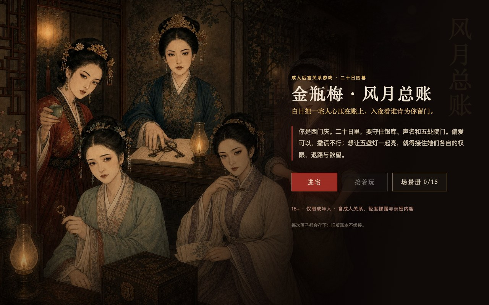

# NovelToGame

> Turn a novel in any language into a source-grounded, fully playable game.

[](https://github.com/zenstory-ai/novel-to-game/actions/workflows/validate.yml) [](https://github.com/zenstory-ai/novel-to-game/releases/latest) [](LICENSE) [](https://github.com/zenstory-ai/novel-to-game/stargazers)

NovelToGame is an open-source Agent Skills toolkit for Claude Code, Codex, and Kimi Code. It turns novel adaptation into a staged workflow: source analysis, concept selection, world and art direction, implementation, and runtime QA.

Bring a novel in any language and choose the target runtime. Generated artifacts follow the requested language; build and QA stay on the chosen platform instead of silently falling back to an easier substitute.

[中文](README_ZH.md) · [Play Online](#play-online) · [Quick Start](#quick-start) · [Workflow](#workflow) · [Skills](#skills) · [Artifacts](#artifacts) · [Contributing](#contributing)

## Play Online

Three playable adaptations, each available in a browser right now and linked to the case study behind it: source provenance, concept trade-offs, game and art direction, runnable source, and evidence from the playable paths.

### Journey to the West · Three Borrowings of the Banana Fan

[](https://xiyouji.vibecoco.ai)

**One wave of a fan blew you fifty thousand li. Take the mountain back one turn at a time.**

Command Wukong's party through the three borrowings of the Banana-Leaf Fan: read the five-element wheel, follow a fire-vein treasure map, decide when to press deeper or bank the haul, transform your way in where force will not work, and turn a demon king who outclasses you into a rainstorm over the Mountain of Flames.

**[Play in browser](https://xiyouji.vibecoco.ai)** · [Read the case study](examples/journey-to-the-west/) · design estimate: 45–90 min · all ages · playable prototype

### Jin Ping Mei · Ledger of Desire

[](https://jinpingmei.vibecoco.ai)

**Choose whose door you enter tonight. Find out whose door knocks in the morning.**

Twenty days, five courtyards. Keep silver, influence, reputation, exposure, and household strain in balance; respect each woman's terms; build trust through shared crises; and face a final ledger shaped by what everyone chose and remembers.

**[Play in browser](https://jinpingmei.vibecoco.ai)** · [Read the case study](examples/jin-ping-mei/) · design estimate: 60–90 min · 18+ · playable prototype

### Project Plateau · The Lost World · 3D

A real-time **first-person 3D field-photography game** adapted from Arthur Conan Doyle's *The Lost World*. Cross a connected plateau, observe a living Iguanodon family, expose four glass plates under aerial pressure, and return with the views that survived.

Play the full expedition on desktop, or watch the 15-second gameplay preview on other devices.

https://github.com/user-attachments/assets/27819247-4e4d-4bf0-8f0f-43d4125c4d45

**[Play in your browser — no install](https://plateau.vibecoco.ai)** · [Read the case study](examples/project-plateau/) · [Share feedback](https://github.com/zenstory-ai/novel-to-game/discussions/7) · 1–3 min run · desktop WebGL2 · playable prototype

## Why NovelToGame

A one-line “turn this book into a game” prompt often produces a generic reskin or a clickable plot summary. NovelToGame keeps the adaptation traceable and gives each major decision a clear owner:

- **Source-grounded adaptation:** extract rules, spaces, character agency, conflicts, and visual anchors with citations;
- **Real game design:** turn source evidence into player verbs, systems, levels, feedback, failure, and outcomes;
- **Target-runtime delivery:** build for the approved platform or engine without implementation silently redesigning the game;
- **Optional, restrained voice:** synthesize only selected high-value lines at build time, keep subtitles and mute fallbacks, and never send the whole novel to a TTS provider by default;
- **Evidence-based QA:** verify startup, rendering, input, the core loop, an outcome, restart, and explicit limitations in the tested runtime.

## Quick Start

### 1. Install the seven skills

| Agent CLI | Install | Invoke |
|---|---|---|
| Claude Code | `npx skills add zenstory-ai/novel-to-game -g -y -a claude-code -s '*'` | `/novel-to-game` |
| Codex | `npx skills add zenstory-ai/novel-to-game -g -y -a codex -s '*'` | `$novel-to-game` |
| Kimi Code | `npx skills add zenstory-ai/novel-to-game -g -y -a kimi-code-cli -s '*'` | `/skill:novel-to-game` |

Install adapters for all three CLIs on the same machine:

```bash
npx skills add zenstory-ai/novel-to-game -g -y -s '*' \
  -a claude-code -a codex -a kimi-code-cli
```

Cloning the repository also enables project-local skill discovery in all three CLIs.

### 2. Start an adaptation

Give the agent a novel file, directory, or link:

```text
Use novel-to-game quick to adapt this novel into a fully playable game.
Recommend the target platform, genre, and engine from the source, and keep the first build to about 15 minutes.
Let the player enter the world as an original character with a new playable route through its conflict.
```

When you want an **interactive story** rather than a systems game, say so. That locks the `narrative-led` experience profile, so concept, design, and QA judge continuous scenes, character dialogue, testimony, and key choices instead of applying rounds, cards, and resource bars:

```text
Use novel-to-game quick to adapt this novel into an interactive story.
Carry the experience with continuous scenes, character dialogue, testimony, and key choices.
Keep variables as hidden causal tags rather than a visible stat panel.
Key choices must change later scenes, character attitudes, and the ending, and be named back in later text.
```

The narrative track **lowers no standard**: it still needs a recognizable gameplay precedent, the same
three-phase arc, and the same hard vetoes. Only the expression changes -- new people to question, new ways to
press a contradiction, and attitudes that shifted because of what you did earlier.

`quick` is the low-friction option: the agent drafts sensible defaults, asks only about materially branching or safety-sensitive choices, compares three concepts, and continues through design, build, and QA. Every project runs one minimum QA path covering real startup, rendering, input, a complete loop, an outcome, restart, and explicit limitations. It does not require a human playtest or a separate approval report. Choose `director` when you want to pick the concept yourself.

<details>
<summary><strong>Native plugin installation</strong></summary>

#### Claude Code

```text
/plugin marketplace add zenstory-ai/novel-to-game
/plugin install novel-to-game@novel-to-game-skills
/novel-to-game:novel-to-game quick
```

#### Codex

```bash
codex plugin marketplace add zenstory-ai/novel-to-game
codex plugin add novel-to-game@novel-to-game-skills
```

#### Kimi Code 0.27 or newer

```text
/plugins install https://github.com/zenstory-ai/novel-to-game
/reload
/skill:novel-to-game quick
```

</details>

## Workflow

The orchestrator locks `PRODUCT_BRIEF.md`, then hands the adaptation through separately owned decisions. Concept, experience/level design, and art direction remain distinct. After world design, a risk-matched whitebox tests the hardest causal, systemic, spatial, or control question before art production; its findings return to the design owner rather than becoming a new QA gate.

```text
Novel → Source analysis → Concept → World design → Risk-matched whitebox ↺ → Art direction → Production build → QA → Playable game
```

The whitebox runs only the narrow model/replay check needed for its declared risk. The production build targets the chosen runtime and prepares one authoritative verification entry point; QA runs it once and records the six minimum player-visible effects with real execution evidence. Capability-specific regression checks run only when that capability is actually adopted. No human-playtest gate or duplicate QA report is required. Source identity, public hosting, marketing, rights, subjective fun, and publication quality are not machine-proven by this QA record.

## Skills

| Skill | Responsibility |
|---|---|
| [`novel-to-game`](skills/novel-to-game/) | Confirm requirements, choose a mode, orchestrate stage handoffs, and recover progress |
| [`novel-game-analyze`](skills/novel-game-analyze/) | Extract cited rules, verbs, spaces, agents, systems, and signature moments |
| [`game-concept`](skills/game-concept/) | Generate three materially different directions, reject invalid options, and choose one |
| [`game-world-design`](skills/game-world-design/) | Define the player promise, core loop, world response, systems, levels, failure, and outcomes |
| [`game-art-direction`](skills/game-art-direction/) | Define camera, composition, visual grammar, colour, light, materials, HUD, motion, and sound |
| [`game-build`](skills/game-build/) | Build a risk-matched whitebox, then implement the approved production candidate without redesigning it |
| [`game-qa`](skills/game-qa/) | Verify commands, states, screenshots, and real play paths without overstating subjective results |

## Artifacts

Each run creates a compact, self-contained adaptation workspace:

```text
game-adaptations/<project>/
  PRODUCT_BRIEF.md
  analysis/SOURCE_BIBLE.md
  concepts/CONCEPT.md
  design/GAME_DESIGN.md
  design/ART_DIRECTION.md
  build/BUILD_BRIEF.md
  build/app/
  qa/verification.json
  _progress.md
```

Core design documents remain independent of any single model or game engine. The approved target runtime determines the implementation and QA environment.

## Contributing

Reproducible bugs, skill gaps backed by evidence, and example proposals that demonstrate a distinct adaptation lesson are welcome. Read the [contribution guide](CONTRIBUTING.md) and use the repository's structured issue and pull request templates.

## License

NovelToGame is released under the [MIT License](LICENSE).

## Acknowledgments

Thanks to the [linux.do](https://linux.do) community for early feedback and support.
