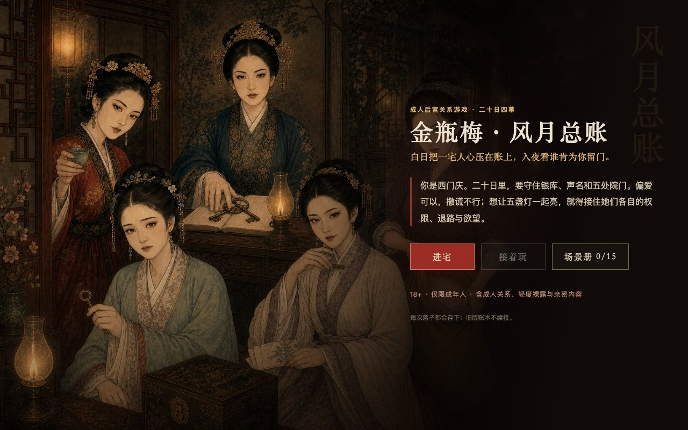

<p align="center">
  
</p>

<h1 align="center">NovelToGame</h1>

<p align="center">
  <b>A source-grounded novel-to-game workflow: adaptation design, target-runtime builds, and evidence-based QA.</b>
</p>

<p align="center">
  <a href="https://zenstory.ai/novel-to-game"><b>Project page</b></a>
  &nbsp;·&nbsp;
  <a href="#install"><b>Install</b></a>
  &nbsp;·&nbsp;
  <a href="#see-what-it-produces"><b>See what it produces</b></a>
  &nbsp;·&nbsp;
  <a href="README_ZH.md"><b>中文</b></a>
</p>

<p align="center">
  <a href="https://github.com/zenstory-ai/novel-to-game/stargazers"></a>
  <a href="https://github.com/zenstory-ai/novel-to-game/releases/latest"></a>
  
  <a href="https://github.com/zenstory-ai/novel-to-game/actions/workflows/validate.yml"></a>
  <a href="./LICENSE"></a>
</p>

<p align="center">
  <a href="https://github.com/zenstory-ai/novel-to-game/discussions"></a>
  <a href="https://github.com/zenstory-ai/novel-to-game/issues"></a>
</p>

NovelToGame is seven open-source skills for the coding agent you already use (Claude Code, Codex, or Kimi Code). Give it a novel and, if you have one in mind, a target platform or engine. It reads the whole book, chooses a game direction it can defend, designs the world and the look, builds for the runtime the brief locks, and proves the build plays in one recorded run. You get a playable build at the finish level you asked for, plus the design documents behind it. The three public examples below play in a browser right now, no install.

## Play Online

Each game links to the adaptation workspace behind it: source provenance, the concept and the directions it rejected, game and art direction, runnable source, and the QA record from the playable path.

### Journey to the West · Three Borrowings of the Banana Fan

<p>
  <a href="https://xiyouji.vibecoco.ai"></a>
  <a href="https://xiyouji.vibecoco.ai"></a>
</p>

**One wave of a fan blew you fifty thousand li. Walk back, take the quest, and win the mountain one turn at a time.**

A Fantasy Westward Journey-style turn-based RPG built on chapters 59–61. Click to walk four painted scene maps, find the NPCs marked "!", let the quest tracker auto-path you there, and take the repeatable demon-bounty daily between story fights. Earn experience and silver, shop, swap gear, study skills and field a pet; then win command-turn battles with the five-element wheel, rage stunts and Wukong's seventy-two transformations, until a demon king who outclasses you ends as rain over the Mountain of Flames.

**[Play in browser](https://xiyouji.vibecoco.ai)** · [Adaptation workspace](examples/journey-to-the-west/) · design estimate: 45–90 min · all ages · playable prototype

### Jin Ping Mei · Ledger of Desire

<p>
  <a href="https://jinpingmei.vibecoco.ai"></a>
  <a href="https://jinpingmei.vibecoco.ai"></a>
</p>

**That spring, five doors kept a lamp lit for you. Whatever you say, they remember.**

A galgame-style romance ADV set in the Ximen household the spring after Li Ping'er marries in. A common route puts all five women at one table, in one night of rain and at one Qingming feast; what your choices build with each of them decides which courtyard doors are still lit on the night the routes split. Each of the five heroine routes has a good, an ordinary and a missed ending (16 endings, counting the one where no lamp is left), and every heroine ending turns to a fixed page of what the novel does to her (the no-lamp ending turns to Ximen Qing's death and the household scattering). Auto, read-only skip, backlog, hide, quick save, thumbnail saves and rollback are there, with a CG gallery, scene replay, music room and ending flowchart.

**[Play in browser](https://jinpingmei.vibecoco.ai)** · [Adaptation workspace](examples/jin-ping-mei/) · design estimate: 20–30 min per route, 1–1.5 h for all five · 18+ · playable prototype

### Project Plateau · The Lost World · 3D

A real-time **first-person 3D field-photography game** adapted from Arthur Conan Doyle's *The Lost World*. Under a low western sun, walk out from Fort Challenger through knee-high grass, keep to a band of thorn arches for cover, and expose four glass plates through a long lens. Each plate is graded on the spot from what the live camera actually framed, with stamps and a line from the sceptical Summerlee. A pterodactyl circles before it dives, a stegosaurus may come down to drink at the brook, and you have 300 seconds of light to bring the plates back.

Play the full expedition on desktop, or watch the 15-second gameplay preview on other devices. It is a real capture of the current build.

https://github.com/user-attachments/assets/5ad62a58-1abe-4d73-b86e-1c8c6563fdb2

**[Play in your browser — no install](https://plateau.vibecoco.ai)** · [Adaptation workspace](examples/project-plateau/) · [Share feedback](https://github.com/zenstory-ai/novel-to-game/discussions/7) · design estimate: 5–10 min (300 s of light per run) · desktop WebGL2 · playable prototype

## What it is

There is no GPU, no hosted service, and no bundled engine: the skills run on the model of whichever agent you installed them into. A one-line "turn this book into a game" prompt usually yields a reskin or a clickable plot summary, so the work is split into stages. Each stage owns one document, and every decision in it has to cite evidence:

- **Every design decision cites the novel.** Analysis reads the whole book and writes a `SOURCE_BIBLE` where every hard rule, key character goal, turning point and ending, and signature anchor carries its chapter or file location, and every adaptation-boundary row cites its evidence. Source facts are labelled `immutable`, `adaptable`, `open`, or `conflicted`; anything the novel does not define is marked a design invention, never smuggled in as fact.
- **The game shape is a documented decision, not a default.** The concept stage compares real alternatives and kills directions with named hard vetoes (the core loop ignores the novel's central tension; strip the proper nouns and a generic template remains; the player only spends resources to release a fixed plot). Concept, world design, and art direction are written by different stages into different documents, and the build may not quietly redesign them.
- **A borrowed genre comes with its shell.** Players recognise a genre by more than its core mechanic, so a systems game lists which parts of the genre's shell (entering the world, objective guidance, progression and reasons to return) it implements, degrades, or drops and why, and what the first minute shows. A Fantasy Westward Journey-style RPG is not shipped as a bare chain of fights.
- **Built for the runtime the brief locks.** The product brief, the one-page requirements sheet the agent drafts first (in `quick` it stops for your decision only on blocking items such as platform, rights, or adult content), locks platform, engine, target runtime, and the runtime actually available for testing. A missing toolchain may not silently become a web build. The design documents are engine-independent Markdown you own.
- **QA is one real run, six checks, and honest limitations.** The build is launched on the tested runtime and one complete execution proves `launch`, `render`, `input`, `coreLoop`, `outcome`, and `restart`. Fun, balance, other browsers, and rights are written as limitations, never as PASS.
- **Voice is opt-in and generated at build time by default.** No line goes to a text-to-speech provider unless art direction chooses voice; runtime synthesis needs the product brief's explicit approval, and the novel and design documents are never uploaded.

Interactive fiction is a first-class track: continuous scenes, dialogue, testimony, and key choices can carry the whole game, held to the same agency and evidence requirements as a systems game. On a character route, a key choice targets that character's own wound or agenda, and the relationship shows in reactions, forms of address, the places that open to you and what you are trusted with, not in an on-screen number.

## Install

### ClawHub

ClawHub distribution is governed by the repository's [explicit publish inventory](.clawhub/publish.json), with discovery through [ClawHub](https://clawhub.ai/). A skill-specific link is added here only after its publisher, version, and anonymous accessibility are verified, so this README never presents a nonexistent listing as live.


Prerequisite: you already use Claude Code, Codex, or Kimi Code, and `npx` (Node.js) runs in your terminal.

| Agent CLI | Install | Invoke |
|---|---|---|
| Claude Code | `npx skills add zenstory-ai/novel-to-game -g -y -a claude-code -s '*'` | `/novel-to-game` |
| Codex | `npx skills add zenstory-ai/novel-to-game -g -y -a codex -s '*'` | `$novel-to-game` |
| Kimi Code | `npx skills add zenstory-ai/novel-to-game -g -y -a kimi-code-cli -s '*'` | `/skill:novel-to-game` |

`-g` installs globally for every directory; drop it to install into the current directory only. **To update, run the same command again, or `npx skills update`.**

<details>
<summary><strong>All three CLIs at once, or native plugin installation</strong></summary>

Install adapters for all three CLIs on the same machine:

```bash
npx skills add zenstory-ai/novel-to-game -g -y -s '*' \
  -a claude-code -a codex -a kimi-code-cli
```

Cloning the repository also enables project-local skill discovery in all three CLIs.

#### Claude Code

```text
/plugin marketplace add zenstory-ai/novel-to-game
/plugin install novel-to-game@novel-to-game-skills
/novel-to-game:novel-to-game quick
```

#### Codex

```bash
codex plugin marketplace add zenstory-ai/novel-to-game
codex plugin add novel-to-game@novel-to-game-skills
```

#### Kimi Code 0.27 or newer

```text
/plugins install https://github.com/zenstory-ai/novel-to-game
/reload
/skill:novel-to-game quick
```

</details>

> Changes are in [CHANGELOG.md](CHANGELOG.md) and [Releases](https://github.com/zenstory-ai/novel-to-game/releases). The repository moved from `worldwonderer/novel-to-game` to `zenstory-ai/novel-to-game`; install and marketplace commands from older docs no longer resolve, and the commands above are current.

## See what it produces

Every excerpt below is copied from a file in this repository; the two Chinese examples keep their documents in Simplified Chinese, so their Markdown excerpts are translated here and marked as such, while JSON records are quoted as they are and glossed in the surrounding text. The originals are linked. Cuts are marked with "…".

### What the design documents look like

In [Journey to the West](examples/journey-to-the-west/), the Banana-Leaf Fan (owned by Rakshasi, the Bull Demon King's wife) enters the analysis as facts pinned to chapters, in [`analysis/SOURCE_BIBLE.md`](examples/journey-to-the-west/analysis/SOURCE_BIBLE.md) (translated; 3 of the table's 11 rows):

```markdown
| Fact | Evidence |
|---|---|
| The true fan quells fire with one wave, raises wind with two, brings rain with three; Rakshasi first blows Wukong away with it, and he returns after obtaining the wind-fixing pill from Bodhisattva Lingji | Chapter 59 |
| Wukong turns into an insect and enters her belly to force the fan out of her, but receives a fake; the fake fan raises the flames three times in a row | Chapter 59 |
…
| The Bull Demon King also commands the seventy-two transformations; disguised as Bajie he tricks the true fan back, and Wukong, flushed with success, does not look closely | Chapter 61 |
```

[`concepts/CONCEPT.md`](examples/journey-to-the-west/concepts/CONCEPT.md) turns the fan into a two-sided rule, the fake fan feeding the fire and the true fan's three waves turning the boss fight, and records which rival directions died, and on which veto (translated):

```markdown
Hard-veto results (one line per direction):

- Direction 1 · Three Borrowings of the Banana Fan: passes (none of the six triggered).
- Direction 2 · The Westward Post Road: triggers item 2 — within the slice length, relationship building decays into event buttons and stat bars with no repeatable trade-off — eliminated.
- Direction 3 · Two Hearts: triggers item 3 — in the novel the true and the false are told apart by the Buddha, so the player's core tension cannot become a reliable mechanic (it would need a tell the novel does not contain) — eliminated.
```

[`design/GAME_DESIGN.md`](examples/journey-to-the-west/design/GAME_DESIGN.md) gives each wave exact effects and durations, and says why the timing of the third wave is the final battle's core decision (translated):

```markdown
| Order | Effect (all enemies, ignores the five elements) | Source |
|---|---|---|
| First wave · Quell fire | Clears enemy buffs (keeps the guard-break / stun / exposure our side applied); enemy attack −30% (3 turns) | One wave quells fire |
| Second wave · Raise wind | Whole party speed +30% (3 turns), seizing the head of the action queue | Two waves raise wind |
| Third wave · Bring rain | Party heals over time (8% max stamina per action, 3 turns); enemy defence −25% and **exposed (damage taken +60%)**, all for 3 turns | Three waves bring rain |

The three stages are both a power curve and the ritual of the "three borrowings": first suppress the enemy's offence, then seize the initiative, then open the exposure window and focus fire,
taking down the White Bull's true form with your companion beast and transformations. The rain's exposure window is the only chance for a quick kill in the final battle: the White Bull's true form stacks frenzy every turn,
and dragging it out means you will be killed in turn, so "when to open the third wave" is the core decision of the finale.
```

The same document lists the genre's shell around those battles, and what was implemented, degraded, or dropped (translated; 4 of the table's 8 rows):

```markdown
| Genre shell | State | How / why |
|---|---|---|
| Entering the world and moving | Implemented | Four walkable 3/4 scenes (Flame Mountain village, Cuiyun Mountain, the fire mouth, Jilei Mountain); click-to-walk, arrow-key walking, teal teleport circles (click the circle or its name) |
| Objective guidance / tracking | Implemented | "!" above main-quest NPCs; one click on the quest tracker on the right auto-paths, across maps too; minimap at top left |
…
| Pets | Degraded | Two fixed pets (the Water-Repelling Golden-Eyed Beast and a catchable fire demon), one in battle; no collection pool, breeding, or rerolling — a 45–90 minute campaign has no use for them |
…
| Parties / trading / PVP | Not done | A single-player offline game with no second player; master and three disciples are the fixed party |
```

[`design/ART_DIRECTION.md`](examples/journey-to-the-west/design/ART_DIRECTION.md) sets the bar as the genre's own screenshots, then gives each wave of the fan its own effect and saves the lasting change to the world for the ending (translated):

```markdown
**Any in-game screenshot, taken at random, should look like a game screen from a turn-based Journey to the West online game such as Fantasy Westward Journey or Wen Dao**: painted 3/4 top-down walking scenes,
small HUD cards pinned to the four corners, names and quest markers over heads; battles with two rows of standing figures, enemy left and party right, an action-order bar along the top and a command panel at the bottom.
What is borrowed is the genre's form and readability, not their chibi big heads, outlines, or specific character designs.
…
5. **The true fan's three waves**: each wave gets a teal-outlined banner, followed by two or three seconds of full-screen tint and particles — ash settling as the fire is quelled, wind streaks, rain lines.
   The lasting change to the world belongs to the ending: the Mountain of Flames becomes a new rain-soaked landscape with no open flame (`huoyan-rain`), with the restart button always visible.
```

And [`qa/verification.json`](examples/journey-to-the-west/qa/verification.json) records the real browser run that reached that ending and started over:

```json
"completeRun": {
  "id": "journey-to-the-west-main-path",
  "cleanContext": true,
  "terminal": "ending: 三借芭蕉扇 · 完",
  "restart": "new campaign title",
  "evidence": "qa/evidence/automated.json"
},
"checks": {
  "launch": "PASS",
  "render": "PASS",
  "input": "PASS",
  "coreLoop": "PASS",
  "outcome": "PASS",
  "restart": "PASS"
},
```

### How a choice is written so the game remembers it

[Jin Ping Mei](examples/jin-ping-mei/) is the romance-ADV example. It was rebuilt from a 20-day household-ledger simulation into a galgame, and [`concepts/CONCEPT.md`](examples/jin-ping-mei/concepts/CONCEPT.md) now gives each heroine something she wants and a wound only the player gets to see, each pinned to chapters (translated; 3 of the table's 5 rows):

```markdown
Core sentence: **Whatever you said, they remember.**
…
| Character | What she wants | Her wound | Source basis |
|---|---|---|---|
| Wu Yueniang | To be asked first about what matters | She is the principal wife only in front of others | Chapters 1, 21 |
| Pan Jinlian | To be seen, to be chosen first | Apart from the way you look at her, she has nothing | Chapters 8, 9, 38 |
| Li Ping'er | Safety and certainty | Seen first as a trunk of valuables, only later as a person | Chapters 14, 16, 19 |
```

[`design/GAME_DESIGN.md`](examples/jin-ping-mei/design/GAME_DESIGN.md) keeps affection off the screen, aims each route's key choice at her wound, and says what decides the ending (translated; 2 of the route table's 5 rows):

```markdown
Choices show no numbers. Affection has only three outlets: her expression and lines; whether her courtyard door is "lit" on the night the routes split; and an optional "feelings" glance in the system menu
(only her look and "the lamp is lit / the lamp is going out", no tiers and no numbers). Yueniang states the rule in the first chapter: on the night the Qingming feast breaks up, only a door still lit can be entered.
…
| Character | Source basis | Key choice (the right move) | Good | Ordinary | Missed |
|---|---|---|---|---|---|
…
| Pan Jinlian | Chapters 8, 38: sends verses longing for him; plays the pipa on a snowy night | Do not open Ping'er's trunks for her, but stay with her tonight | The pipa is not cold | The side gate left ajar | The fan falls |
| Li Ping'er | Chapters 14, 19: entrusts herself over the garden wall; met coldly when she marries in | Do not take her keys; say in front of everyone that her silver is hers | The keys in her hand | Tea under the window | The trunks |
…
Ending rule: get the key choice wrong → Missed; get it right, with her affection ≥7 and the truth told at the last question → Good; otherwise → Ordinary.
```

Every heroine ending then turns to a page of what the novel does to her, and the same document is plain about it: the ending decides only what the two of you made of this one spring, and the page footer says it cannot change where she goes in the book.

The QA record is candid about how much of that was played. In [`qa/verification.json`](examples/jin-ping-mei/qa/verification.json), the complete browser run ends at `yue_good` and all six checks pass; the first and last limitations read:

```json
{
  "scope": "路径覆盖",
  "reason": "浏览器只走月娘良缘一条完整路径；其余 15 个结局由 test/lint_script.mjs 穷举选择证明可达，未逐一在浏览器渲染。"
},
…
{
  "scope": "体验判断",
  "reason": "自动化只证明能启动、渲染、输入、走到结局并重开，不判断剧情是否动人或节奏是否合适。"
}
```

That is: the browser walked only Wu Yueniang's good-ending route, and the other 15 endings were shown reachable by exhausting the choices in `test/lint_script.mjs`, not rendered one by one. Automation proves the game launches, renders, takes input, reaches an ending and restarts; it does not judge whether the story moves anyone or whether the pacing is right.

### What the QA record admits it did not test

[Project Plateau](examples/project-plateau/) is the 3D example, and its documents are in English. Its concept compared three directions, each anchored to a chapter slice: A · Proof Before Dark (field observation and returning with damaged proof), B · Fire Across the Lake (following the brook to the lake and escaping a tracking predator), and C · The Eighteenth Cave (a proof-carrying descent). It also wrote down the condition under which the winner should be abandoned, in [`concepts/CONCEPT.md`](examples/project-plateau/concepts/CONCEPT.md):

```markdown
All three support repeatable player decisions and bounded prototypes. Direction A wins
because it carries the whole adaptation promise—scout, document, survive and extract—
in one readable daylight frame, while B narrows the game to pursuit and C narrows it to
route interpretation.
…
The selected direction is falsified if position or timing cannot create a visibly better
plate, or if recording never changes a later route or defense decision. `GAME_DESIGN.md`
must define that causal chain and preserve the non-lethal scout fantasy.
```

`npm run verify` drives the real build with keyboard and mouse events and writes the input trace and `qa/verification.json` in the same run. The trace in [`build/evidence/current-run/report.json`](examples/project-plateau/build/evidence/current-run/report.json) is the whole expedition, out along the thorn band to the blind and back:

```json
"inputTrace": [
  "KeyW: reach the brook",
  "Right Mouse + Left Mouse: record the brook",
  "KeyW: reach the basalt shelf",
  "Right Mouse + Left Mouse: record basalt scale",
  "KeyA: step under the thorn arches",
  …
  "KeyW: settle in the glade-edge blind",
  "Right Mouse + Left Mouse: record young at play from the blind",
  "hold KeyC under cover: crouch until the wings lose interest",
  …
  "KeyS: back up the thorn band to Fort"
]
```

[`build/BUILD_BRIEF.md`](examples/project-plateau/build/BUILD_BRIEF.md) says exactly what that PASS means:

```markdown
…
PASS proves the six effects only in the recorded local
desktop browser. It does not prove subjective visual quality, comfort, fun, balance,
rights clearance, public hosting or other browsers, GPUs and devices.
```

And [`qa/verification.json`](examples/project-plateau/qa/verification.json) names what this run left out, including the new stegosaurus beat:

```json
{
  "scope": "optional stegosaurus beat",
  "reason": "The complete run does not photograph the stegosaurus; its framing rule is covered by one unit test only."
},
{
  "scope": "look, sound and hitches",
  "reason": "Visual quality is a reviewed judgment; the sound beds were not heard on laptop speakers and frame hitches were not measured on an unloaded or low-end machine."
}
```

The session length moved twice, once on evidence and once on an owner decision, and [`PRODUCT_BRIEF.md`](examples/project-plateau/PRODUCT_BRIEF.md) keeps both steps. The first measured run crossed the whole route in 55.2 seconds, which falsified the planned 5–8 minute session, so the boundary was cut to a 1–3 minute run with 180 seconds of light instead of padding the route with waits. When the owner later asked for a longer 5–10 minute visit, the light budget went to 300 seconds and was filled with new decisions (the optional Chapter XII stegosaurus beat and plate-by-plate grading) rather than more walking; a learned Strong path still finishes in about 90 seconds.

## Your first request

Give the agent a novel file, directory, or link, then copy one of these requests and adjust it.

**A systems game with a new playable route:**

```text
Use novel-to-game quick to adapt this novel into a fully playable game.
Recommend the target platform, genre, and engine from the source, and keep the first build to about 15 minutes.
Let the player enter the world as an original character with a new playable route through its conflict.
```

**An interactive story** (this locks the `narrative-led` experience profile, so concept, design, and QA judge continuous scenes, character dialogue, testimony, and key choices instead of rounds, cards, and resource bars):

```text
Use novel-to-game quick to adapt this novel into an interactive story.
Carry the experience with continuous scenes, character dialogue, testimony, and key choices.
Keep variables as hidden causal tags rather than a visible stat panel.
Key choices must change later scenes, character attitudes, and the ending, and be named back in later text.
```

**Design notes only, no build yet:**

```text
Using my authorized source, plan one small gameplay-design slice for my target engine.
Keep the choices and outcomes bounded; show each option's evidence, cost, visible effect, and where a later scene uses its state.
Label allowed additions and unresolved questions. Deliver design notes only—do not build, run QA, or claim a finished runtime.
```

`quick` is the default: the agent drafts a product brief with sensible defaults, asks only about choices that materially change direction or touch safety, compares meaningful alternatives, and continues through design, build, and QA. Choose `director` when you want to pick the concept yourself; the agent stops at the concept stage with candidates and a recommendation, unless you have already named a direction.

## Workflow

```text
Novel → Source analysis → Concept → World design → Risk-matched whitebox ↺ → Art direction → Production build → QA → Playable game
```

After world design, a whitebox (a rough build without final art) tests only the single largest design risk before full art production: narrative causality can be checked in text, but real-time control, space, physics, or camera cannot, and what it shows goes back to the design stage. The production build targets the approved runtime and prepares one authoritative verification command. QA may diagnose, fix, and rerun, but the final record binds all six checks to the same complete run; findings flow back to the product, design, art, or build document that owns them.

## Skills

| Skill | Responsibility |
|---|---|
| [`novel-to-game`](skills/novel-to-game/) | Confirm requirements, choose a mode, orchestrate stage handoffs, and recover progress |
| [`novel-game-analyze`](skills/novel-game-analyze/) | Extract cited rules, verbs, spaces, agents, systems, and signature moments |
| [`game-concept`](skills/game-concept/) | Compare meaningful alternatives, reject invalid options, and select or validate a direction |
| [`game-world-design`](skills/game-world-design/) | Define the player promise, core loop, world response, systems, levels, failure, and outcomes |
| [`game-art-direction`](skills/game-art-direction/) | Define camera, composition, visual grammar, colour, light, materials, HUD, motion, and sound |
| [`game-build`](skills/game-build/) | Build a risk-matched whitebox, then implement the approved production candidate without redesigning it |
| [`game-qa`](skills/game-qa/) | Verify commands, states, screenshots, and real play paths without overstating subjective results |

## Artifacts

Each run creates a compact, self-contained adaptation workspace:

```text
game-adaptations/<project>/
  PRODUCT_BRIEF.md
  analysis/SOURCE_BIBLE.md
  concepts/CONCEPT.md
  design/GAME_DESIGN.md
  design/ART_DIRECTION.md
  build/BUILD_BRIEF.md
  build/app/
  qa/verification.json
  _progress.md
```

The design documents are engine-agnostic Markdown you own. The target runtime you approve determines the implementation and QA environment.

## FAQ

### I asked for an interactive story and got cards, rounds, and a stat panel. How do I get scenes, dialogue, and key choices instead?

Say so in the request, as the second example above does. That locks `experienceProfile: narrative-led` in the product brief, and the profile carries through concept, design, art, build, and QA. The design method records each key choice as concrete words and deeds, an immediate reaction, and a persistent fact with the later scene that reads it, not a hidden score. This track was added after a reader showed us exactly this failure in [Discussion #17](https://github.com/zenstory-ai/novel-to-game/discussions/17); see [`game-concept`](skills/game-concept/SKILL.md) and the [narrative design method](skills/game-world-design/references/narrative-design-method.md) (both in Chinese).

### How long does a full run take, and what does it cost?

Longer than one prompt. The agent reads the whole novel, writes five design documents, builds, and runs QA, and each stage is a separate skill call, so a full run is long and may span more than one session. Token spend is whatever your coding agent bills; nothing else is paid unless art direction opts into image or voice generation (see the GPU question below). The public examples' progress files do not record wall-clock time or token counts, so this README does not quote a number.

### The session ended halfway. Can it continue?

Yes. Start with `novel-to-game resume`, the third mode beside `quick` and `director`. It reads `_progress.md` and the documents that actually exist, works out the last stage that was genuinely finished, and continues from there; test results are only ever read from `qa/verification.json`. See the [pipeline contract](skills/novel-to-game/references/pipeline-contract.md) (Chinese).

### Which engine or platform does it build for? Will it fall back to a web page if my toolchain is missing?

You choose, and the product brief locks it: platform, production engine, target runtime, and the runtime actually available for testing. The build may not switch to a web page when the target toolchain is unavailable; only a substitute runtime already approved in the brief may be used, and then `targetRuntime`, `testedRuntime`, and the uncovered items are recorded separately. QA treats a substitute run as never proving the target platform. The three public examples are all browser games (two dependency-free static apps and one Three.js + Vite build) because that is what their briefs locked, not because it is the default. No public example yet targets a native engine or console; a Godot, Unity, or mobile build depends on the toolchain present in your environment and is recorded the same way, with anything untested written as a limitation. See [`game-build`](skills/game-build/SKILL.md) and the [QA contract](skills/game-qa/references/qa-contract.md) (both in Chinese).

### Do I need a GPU or my own model? Who pays for images and voice?

No GPU and no separate model: analysis, design, and code are written by the model of the coding agent you already use. External services are opt-in. Generated images are used only when art direction selects them, with the tool chosen in your environment after checking capability, licence, and cost (the Jin Ping Mei example records most of its images, generated with Codex's built-in image tool, batch by batch in `build/art/generated-art.json`). Voice is off unless art direction chooses it; the default is build-time generation into local assets, only the per-line dialogue and any pronunciation notes are sent, and the novel and design documents are never uploaded. Paid services are one of the things the agent stops to ask about before it starts. See the [TTS production contract](skills/game-build/references/tts-production-contract.md) (Chinese).

### How do I know the game it built actually runs? What does the QA PASS mean?

It proves that one authoritative command, in one complete run on the tested runtime, showed six things: the build launched, rendered a non-empty frame that changes, changed state on real input, completed the core loop, reached at least one designed outcome, and restarted to the initial state. Status is only `NOT_RUN`, `FAIL`, or `PASS`; unverified is not a pass, and an old PASS is overwritten by every rerun. Every gap is written as a limitation with a scope and a reason. It does not prove fun, balance, immersion, other browsers or devices, rights, or release quality, and it does not require a human playtest. See the [QA contract](skills/game-qa/references/qa-contract.md) (Chinese).

### My novel is in one language. Can the game be in another?

Yes. Novels in any language are accepted; artifacts use the language you ask for, or the conversation language if you do not say. Quotations and textual evidence stay in the original language, only what a decision needs is translated, and one terminology table holds names, places, objects, and rules. Register, forms of address, character voice, and cultural concepts are kept; rites, religion, and narrative conventions are not swapped for another culture's genre labels. Source language does not decide the interface language; the brief records them separately. See [`novel-game-analyze`](skills/novel-game-analyze/SKILL.md) (Chinese).

### Can I adapt a novel I do not own the rights to?

The skills do not clear rights for you, and QA does not certify them. Copyright, asset licensing, and real persons are among the questions the agent must stop and ask about before it starts; the brief records the compliance boundary and `SOURCE_BIBLE` records the edition, coverage, and authorisation boundary; a concept that depends on another game's protected characters, maps, interface, or text is a hard veto. The public examples use Project Gutenberg texts and record the rights status in each `source/SOURCE.md`, including why the Jin Ping Mei example ships an expurgated text.

### Can I get design documents without a build?

Yes. Use the third request above. Each planning skill stops at its document: the concept writes no code or numeric tables, world design writes no file names or tests, and art direction leaves asset production to the build. Even when you do build, the whitebox proves only the selected top risk and produces no QA verdict; the six checks come only from the production build.

## Further reading

- [Quick-start guide](https://zenstory.ai/novel-to-game/quick-start) — scope a first adaptation: separate authorized source facts, author-approved additions, and open questions, and keep the first slice small.
- [Meaningful-choice guide](https://zenstory.ai/novel-to-game/meaningful-choices) — give each player option evidence, cost, and a visible outcome, and name the later scene that reads its state.
- [NovelToGame compared with story-to-game builders](docs/novel-to-game-vs-story-to-game-tools.md) — the three shapes of tool and where the design documents live.
- [Blender asset feedback](docs/research/blender-asset-feedback.md) (Chinese) — why Blender is a conditional entry in `game-build`, not a default, and what one single-asset experiment did and did not prove.

## Contributing

Reproducible bugs, skill gaps backed by evidence, and example proposals that demonstrate a distinct adaptation lesson are welcome. Use the structured forms in [Issues](https://github.com/zenstory-ai/novel-to-game/issues/new/choose) and read the [contribution guide](CONTRIBUTING.md) for the required checks and the rights rule; questions and early ideas go to [Discussions](https://github.com/zenstory-ai/novel-to-game/discussions).

<a href="https://github.com/zenstory-ai/novel-to-game/graphs/contributors"></a>

## License

NovelToGame is released under the [MIT License](LICENSE).

## Acknowledgments

Thanks to the [linux.do](https://linux.do) community for early feedback and support.

## Part of ZenStory AI

This project is maintained by [ZenStory AI](https://zenstory.ai) — open-source, agent-native tools for creating, adapting and producing stories (GitHub org: [zenstory-ai](https://github.com/zenstory-ai)). Sibling projects:

| Project | What it does |
| --- | --- |
| [oh-story-claudecode](https://github.com/zenstory-ai/oh-story-claudecode) | Web-fiction writing skill pack: chart scanning, deconstruction, drafting, de-AI-flavor, covers |
| [drama-skills](https://github.com/zenstory-ai/drama-skills) | AI short-drama / motion-comic suite: scripts, assets, storyboards, image & video prompts, review |
| [novel-to-game](https://github.com/zenstory-ai/novel-to-game) | Agent skills for source-grounded novel adaptation, target-runtime builds, and evidence-based QA (this repo) |
| [video-recap-skills](https://github.com/zenstory-ai/video-recap-skills) | Create Chinese-narration recaps from supported video files, with optional editable JianYing/CapCut draft export |
| [oh-story-dsh](https://github.com/zenstory-ai/oh-story-dsh) | Community DeepSeek Harness plugin with novel, short-drama, game and video-recap workbenches |
| [zenstory](https://github.com/zenstory-ai/zenstory) | Chat-to-create AI novel-writing workbench ([app.zenstory.ai](https://app.zenstory.ai)) |
